Говорят, что подражание - высшая форма лести. Если это так, то довольно много персонажей должны чувствовать себя польщенными Дэдпулом.

Из-за самосознания Дэдпула он достаточно осведомлен о книгах о комиксах и часто может так же стремиться к взаимодействию с другими известными персонажами комиксов, в качестве их поклонника. Некоторые фанаты окрестили его Багс Банни Marvel, так как он всегда быстро вспоминает ссылки на поп-культуру или даже просто копирует то, что делают его конкуренты.

Если вы считаете, что хорошие заимствуют, в то время как великие воруют, то Дэдпул одни из великих. С самого начала, он был показан подражающим его ровням. Иногда это просто шутка, но в других случаях воровство Дэдпула сыграло главную роль в становлении его персонажа.

Здесь представлены 15 персонажей комиксов, которых копировал Болтливый Наёмник.

## 15. Дефстроук

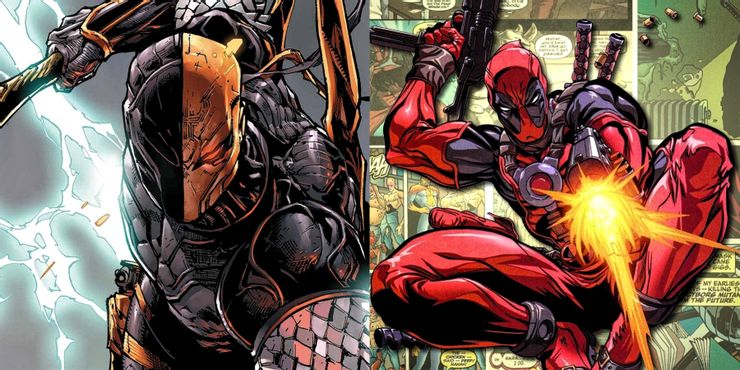

И вот очевидный кандидат. Если вы действительно знаете Дэдпула, вы уже знаете, что он был ответом Марвела на Дефстроука DC. Дефстроук был представлен в то время, когда смелые и мрачные персонажи были в новинку, и люди начали считать это довольно глупым. Так Marvel представил Уэйда Уилсона как Дэдпула в качестве своеобразного ответа на Слэйда Уилсона.

Справедливости ради, в начале Дэдпул был более серьезным антигероем, почти как Дефстроук. Так что сначала их появления были невероятно похожи. Но затем, когда персонаж Дэдпула развивался, он предстал в виде шутника, с которым фанаты связывают его сегодня. Уэйд и Слейд никогда официально не пересекались, несмотря на все возможности между ними, но судя по тому, как Дэдпул взаимодействует с серьезными персонажами Марвела, такими как Каратель, мы не можем себе представить, что Уэйд с большим уважением отнесётся к своему вдохновению.

## 14. Регенерация Росомахи

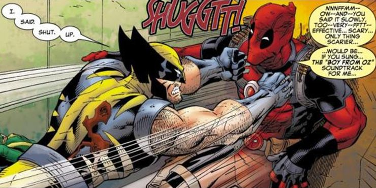

На фоне очевидных примеров копирования, мы должны поговорить о связи Дэдпула с Росомахой. Многие из вас, вероятно, скажут, что Дакен и Х-23 также обладают лечебными возможностями, поэтому у Росомахи нет особых притязаний к этой способности, но он определенно ее создатель. В конце концов, не случайно, что X-23 и Дакен имеют такое тесное отношение к истории Логана. Не исключено, что Дэдпул и друг и враг Логана.

Подобно тому как Дэдпул, копировал Дефсроука, это пример, того как он взял чужую фишку, изменил ее, сделав собственным эксклюзивом, и это стало частью сути того, кем он является. Среди поклонников довольно широко принято утверждение, что у Дэдпула фактор регенерации превосходит фактор Логана. Это позволяет ему пережить рак, вырастить конечности и даже выжить, если отрубить его голову.

Логан пережил довольно много опасных ситуаций, но его исцеляющие способности довольно широко колеблются с точки зрения его возможностей, в то время как Дэдпул частенько изображается как практически неубиваемый.

## 13. Переодевание в телефонной будке как Супермен

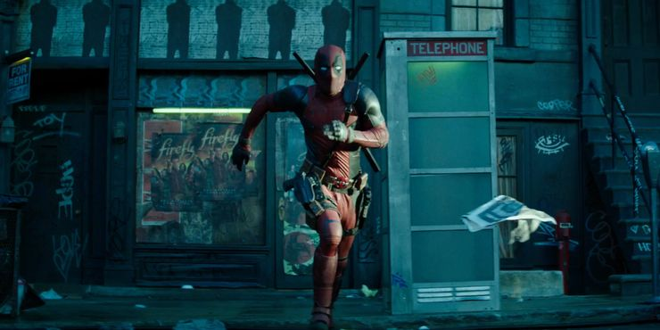

Недавний тизер для Дэдпула 2 показал крайне много смешных моментов в очень короткий промежуток времени, чтобы подготовить фанатов к выпуску полнометражки в следующем году. Коротко говоря, сцена показывает, как Дэдпул переодеваясь «на лету» в свой костюм, чтобы спасти невиновного. Тизер показал даже эпизод с человек-камео Стэном Ли, в то время как жертва ограбления всё ещё находится в опасности.

Сцена является своеобразной пародией на характерный для Супермена момент прыжка в телефонную будку, дабы через несколько секунд выскочить из нее уже готовым супергероем. Уэйд Уилсон показал, как непрактично переодеваться в телефонной будке, со слишком тесным пространством для переодевания, на самом деле это всего лишь трата времени, и более того все дело в будке, сделанной из стекла, так что любой сможет увидеть зад голого героя. Жертва умерла к тому времени, когда Дэдпул начал действовать, поэтому вряд ли он решит снова украсть фишку Супермена.

## 12. Превращение в Халка

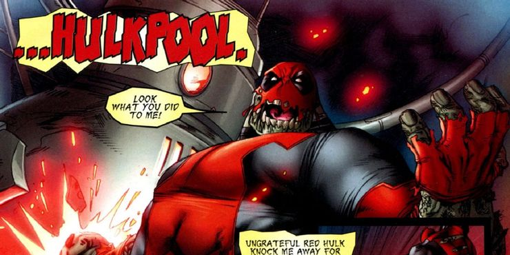

Вот еще один случай с Дэдпулом, скопировавшего еще одного персонажа Marvel. В добавок, фраза «Ну все же мои друзья это делали» обычно является неахти извинением на оказываемое давление, но в случае, если фраза звучит как: «Все мои друзья приобрели способности Халка», все обвинения в вашу сторону могут быть сняты. Как только этот случай произошел, по миру пошел, своего рода, «тренд», который поразил абсолютно всех героев. Порой, в тренде бывали зомби, но ,в этом случае, все превращались в Халков.

Суть истории в том, что злодеи пытаются создать армию Халков для достижения мирового господства и для большого противостояния Красному Халку. Самым крутым моментом, является то, что мы видим, героев, которые обычно не имеют силы Халка, внезапно становятся супер большими и сильными. Люди типа Человека-паука и Циклопа становятся Пауком-Халком и Халколпами ну и конечно же есть Халкпул.

Верный характеру, Халкпул является таким же подстрекателем, как и его не-Халк-коллега, и, как правило, является источником горя для других героев благодаря его сверхсиле, машине времени и его типичным стремлением нажить себе проблемы.

## 11. Стал фальшивым Тором

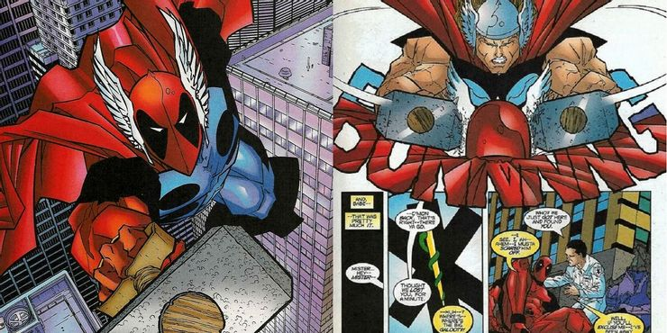

Если плагиат Дефстроука не возымело никаких последствия для Уэйда, то не со всеми этот трюк сработает. Одним из примеров был Тор, который относился к своему статусу бога довольно серьезно.

Предоставьте кому-то вроде Локи возможность преобразовывать Дедпула и всех людей в поддельных Торов. У Дэдпула был бы свой собственный крылатый шлем, липовый Мьёльнир, а его речь стала бы староанглийской. Излишне говорить, что настоящий Тор не был удивлен.

Дэдпул пытался сразиться с настоящим Тором в битве с богами грома, которые были хороши, как и следовало ожидать. Тор быстро разоружил Уэйда с поддельным Мьёльниром. Когда оба молота были в руках, Тор ждал, пока Дэдпула подойдёт ближе, а затем зажал голову Уэйда ударами двух молотов. Он оставил Дэдпула, а когда тот проснулся, то уже был переодет из костюма Тора.

## 10. Носил броню Железного человека

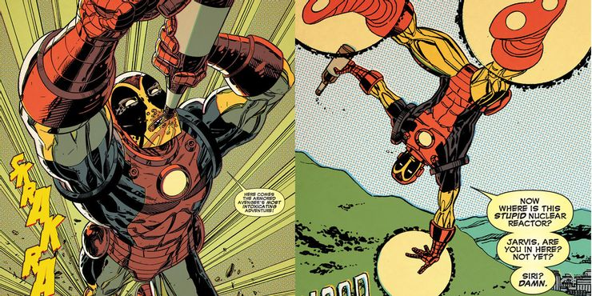

После неудачной попытки Дэдпула поносить костюм Тора, вы можете подумать, что болтливый наёмник, наконец-таки, понял, что супергероям не нравится, когда кто-то крадет их костюмы. Но, возможно, он это знает и ему, в общем-то, плевать. Одна вещь в регенерации Дэдпула незаменима – он может не переживать насчет смерти, если кто-нибудь вдруг сильно разозлится на него и захочет убить. Наверное, это объясняет, почему Дэдпул решил в 2016, что украсть броню Железного Человека – хорошая идея.

Тяжело винить Пула за желание завладеть костюмом Тони с тех пор, как он впервые полетал в нем – это было даже для Уэйда чем-то невообразимым. Когда он был на одной из вечеринок Тони Старка, Дэдпул выбрал время для того, чтобы поиграть с игрушками Тони, пока тот был в отключке.Дэдпул летал по городу, напивался и боролся с преступностью, в общем-то, в точности, как это делал сам Старк. Безусловно, любому веселью, в итоге, приходит конец. Так и случилось, когда Тони обо всем узнал, но, все же, у Дэдпула остались приятные воспоминания, несмотря на то, что он потерял доверие очередного супергероя.

## 9. Стал суперсолдатом

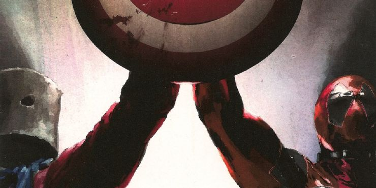

Когда приходит время новому персонажу надеть на себя мантию оригинального героя, порой, случаются небольшие разногласия, в течении переходного периода. Мы уже видели это несколько раз за последние пару лет. Как пример можно взять становление Джейн ФостерТором, Рири Уильямс Железным Человеком или же принятие Х-23 роли Росомахи. Естественно, пришел черед Капитана Америки. Фанаты гадали, кто же продолжит наследие Стива Роджерса. Марвел решили рассказать о том, кто не продолжит его, озаглавив это как: «Капитан Америка: Кто недостоин владения Щитом».

Эта история породила множество насмешек над стереотипами в комиксах Марвел, которые всем уже надоели. Здесь появлялись различные герои, вроде того же Доктора Стренджа, берущего на себя обязанности Капитана Америки. Один стереотип, который фанаты просто терпеть не могут, так это то, что Дэдпул - слишком перенасыщенный персонаж, и в качестве самоиронии, Марвел решили представить, каким бы он был, живя во времена 2й Мировой Войны, как Капитан Америка.

В этой версии Дэдпул, к завершению войны, был заядлым курильщиком и, в качестве маски, он носил противогаз. Но, к счастью для Дэдпула, его роль в войне не окончилась, потому что ему предложили стать подопытным в создании суперсолдат, точно так же, как и Стиву Роджерсу.

## 8. Был первым, кого поразил симбиот

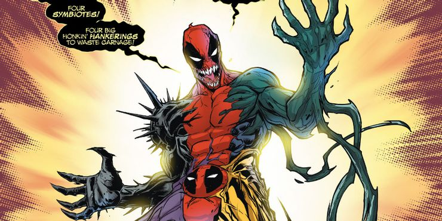

Все знают историю, как симбиот стал основной частью вселенной Марвел. Или, хотя бы, думают, что знают.

История, знакомая всем нам, начинается с того, как симбиот соединился с Человеком Пауком, подарив ему отпадный черный костюм. В дальнейшем Паучок понял, что, на самом деле, этот костюм живой и тот влияет на его личность, так он обнаружил чувствительность симбиота к шумному звуку и решил тем самым избавиться от него раз и навсегда. Он сделал все, что было в его силах, а-ля Горбун из Нотр Дама, взбираясь на колокольню и звоня в колокол, дабы заставить симбиот отделиться от его тела. После этого, пришелец нашел Эдди Брока и слился с ним, тем самым породив Венома!

Проблема заключается лишь в том, что история эта изменилась (спасибо Дэдпулу). Мы узнали, что Питер и Эдди не были первыми, кто слился с симбиотом, на самом деле это был никто иной, как наш дружелюбный Болтливый Наёмник! Дэдпул быстро отсоединился от пришельца, но мозг Дэдпула повлиял на симбиота, сделав его безумно кровожадным и смертоносным.

Так что Дэдпул стал не только тем, кто впервые примерил костюм симбиота, но и ответственным за появление убийственных наклонностей у всех, кто сливался с пришельцем после него.

## 7. Украл смерть у Таноса

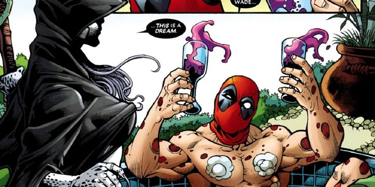

Все прекрасно знают, что Дэдпул обладает регенерацией, так что вы можете предположить, что это единственная причина, по которой Болтливый Наёмник так упорно остается жить. Но есть и другая очень любопытная причина, опять же, связанная с тем, что Дэдпул что-то у кого-то украл. В таком случае, Дэдпул совершил колоссальную ошибку, крадя у самого опасного злодея Марвел: Таноса. И в этот раз Дэдпул не крал его костюм, как он поступал с другими персонажами, нет, он сделал кое-что куда хуже этого, он украл его любовь.

Если вкратце – Танос влюблен в Смерть. Да-да, Смерть – это персонаж из вселенной Марвел, к которой Танос испытывает чувства. Эти чувства настолько сильны, что он однажды полностью уничтожил половину вселенной, только для того, чтобы произвести на нее впечатление, показав к скольким смертям он может быть причастен. Но вот, словно подросток, которому разбили сердце, Танос начал понимать, что Смерть полюбила другого. Как вы могли уже понять, что этот «другой», это никто иной, как великий сердцеед Уэйд Уилсон.

Дэдпул уверенно увел Смерть из объятий Таноса, и когда тот узнал об этом, он был просто в ярости. Он был настолько зол на Дэдпула, что проклял его бессмертием, соответственно, Уэйд никогда не сможет умереть, и навечно останется со Смертью. Логика Таноса…

## 6. Основал «Наем за деньги»

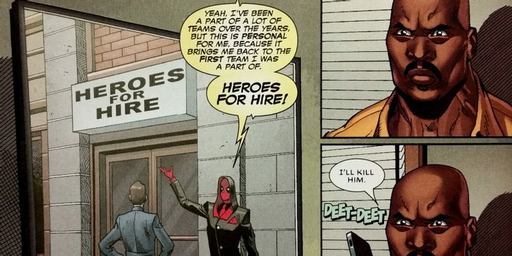

«Герой по найму» – один из псевдонимов Люка Кейджа, так же как и «Болтливый Наёмник» у Дэдпула. Так его прозвали, потому что Люк – был одним из немногих героев, который решил, что он заслуживает вознаграждение за его героизм в качестве денег.

Впоследствии, Кейдж основал супергеройскую команду, из числа его единомышленников, берущих плату за проявленные поступки. Даже Дэдпул состоял в этом сообществе. Но было это в 90-х, так как, впоследствии, увлеченный этим занятием, он основал свою версию этой команды.

К несчастью для Дэдпула, воровство реально даже в комиксах. Когда Люк Кейдж узнал о том, что Дэдпул занимается плагиатом, он не стал с ним драться, как это обычно бывает среди супергероев. Вместо этого, Кейдж решил воспользоваться легальным путем.

Сорвиголова – адвокат, когда он не борется с преступностью, так что Мэтт Мёрдок и Люк начали составлять дело против Дэдпула. Дэдпул способен противостоять многим вещам, но пред законом он бессилен, так что он быстренько сменил название группы на «Наём за Деньги», дабы не нарушать авторские права.

## 5. Копирование обложек Человека паука

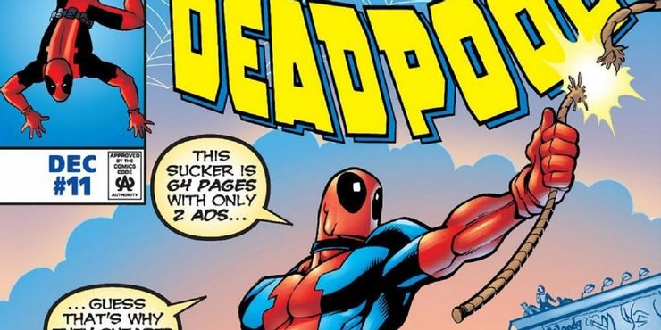

Несмотря на то что оммаж - это пустяк по сравнению с копированием суперсил или личности, Дэдпул и на этом поприще на коне. Ни для кого не секрет, что Дэдпул вдохновлён Спайдер-Меном как в комиксах, так и в реальной жизни. К тому же Спайди с Дэдпулом объединялись в команду в качестве корешей очень часто. Конечно же после этого Уэйд просто обязан был отдать дань уважения парню с плаката от Марвел.

Ничего нового в оммажах обложек комиксов нет, но этот тот  случай когда персонаж настолько далеко уходит от своего образа как на обложке выпуска Deadpool #11. Дэдпул никогда не обладал способностью летать на паутине, но это не остановило его, чтобы повторить акробатическую фишку Спайди. С гражданским за подмышкой, Дэдпул парит между небоскребами, и даже его красно-синий костюм напоминает расцветку стенолаза.

И не всякий мог заметить, что в углу Дэдпул также изображает фирменную позу Спайди, что какбе явно уже намекает...

## 4. Пародия на Бэтмена шлёпающего Робина

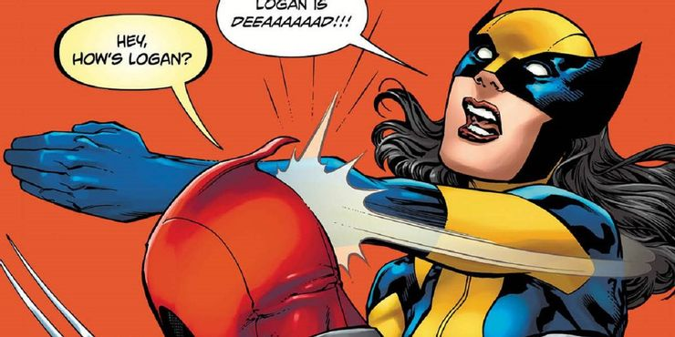

Если вы хоть немного знакомы с интернет-мемами, то явно видел мем, где Бэтмен даёт пощёчину Робину. Самая известная версия та, в которой Робин спрашивает Бэтмена о его родителя, после чего Тёмный Рыцарь бьёт своего протеже с криком: «МОИ РОДИТЕЛИ УМЕРЛИИИИИ!!». Были тонны и тонны других вариантов пока народ соревновался в остроумии. Этот мем стал настолько известным, что даже Марвел поучаствовал в развлечении.

На альтернативная обложка для All-New Wolverine была изображена X-23 в ее новом костюме, унаследованном от погибшего Логан. Четвёртый выпуск имел вариативную обложку, обыгрывающий смерть Логана в стиле интернет-мема. Дэдпул на обложке, спрашивает как дела у Логана, а X-23 прерывает его с пощечиной и криком «ЛОГАН - МЁЁЁЁЁЁРТВ !!!».

## 3. Ходячие мертвецы

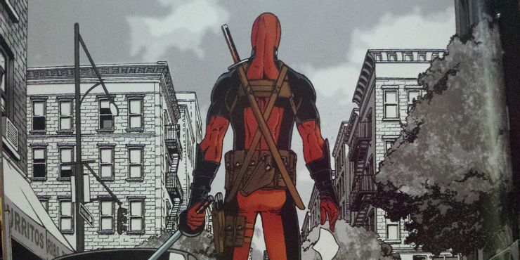

Мало того, что Дэдпул копирует других персонажей, так он ещё замахивается на целую серию комиксов. Если и копировать, то «Ходячие мертвецы» не плохой выбор. Всё же эта история была экранизирована в одно из самых популярных шоу на телевидении. «Ночь живого Дэдпула» был выпущен после того, как «Ходячие мертвецы» в очередной раз запустили волну популярности на тему зомби, поэтому ссылки на серию были действительно неизбежны.

История начинается с отсылки на Ходячих прямо с самого начала. Дедпул просыпается от комы после того, как объелся чимичангами и потерял сознание. Когда он проснулся, то обнаружил предупреждения о том, что мертвые повсюду на улице. Это, конечно же, очень напоминает начало Ходячих Мертвецов, где Рик также был в коме после того, как его расстреляли, а затем проснулся в больнице во время зомби-апокалипсиса.

По правде говоря, «Ночь живого Дэдпула» имеет тонны отсылок на поп-культуру зомби-фильмов, включая таких, как Зомбилэнд, а также на очевидные Ночь живых мертвецов. Но ссылки на «Ходячих мертвецов» не заканчивались на вступлении, а сопровождали Дэдпулу по всей сюжетной линии.

## 2. Украл глаза-лазеры Циклопа и способность телепортации Ночного Змея

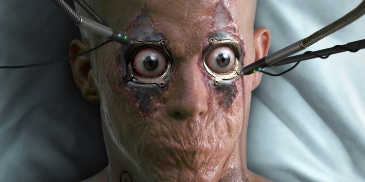

Дэдпул в Людях-Икс Начало: Россомаха - это большое недоразумение для всех фанатов, которое хочется забыть. Несмотря на это у него была довольно привлекательная смесь сил. Этот Дэдпул был просто химерой, состоящий из способностей других могущественных мутантов. Это сделало его смертельной угрозой, но это всё же было не то.

У этой версии Уэйда был не только исцеляющий фактор, как у Росомахи, но и адамантовые когти Росомахи, выскакивающих из его рук, как мечи. В дополнение к этому, он также умел телепортироваться, как Ночной змей, что он активно использовал в борьбе с Росомахой и Саблезубом одновременно. А если всего этого было недостаточно, то у него были все возможности для дистанционной атаки. Он шмалял как Циклоп из глах лазерами. А глазные лазеры Дедпула были даже лучше, чем у Скотта, так как Дэдпул мог контролировать выстрелы с помощью ингибиторных глазных засов.

Было интересно увидеть кого-то с такими возможностями, но мы определенно рады видеть Дедпула в более верном для комикса образом.

## 1. Шорюкен Рю

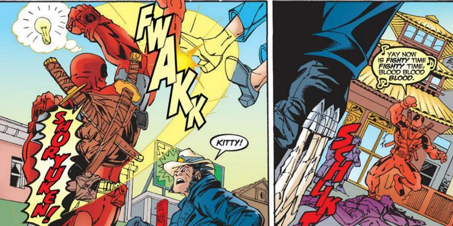

Рю - это не тот персонаж, который приходит в голову к большинству людей, когда вспоминаются персонажи комиксов, но были комиксы по мотивам игры Street Fighter. Очевидно, Дедпул тоже является поклонником Street Fighter, потому что он был очень рад исполнить одно из фирменных движений игры против своего соперника. Все началось в комиксах Дэдпула, где он искал кого-нибудь, чтобы сразиться с ним, и, наконец, решил попытаться спровоцировать Росомаху на драку. Логан сначала отказывался, потому что в то время он был с Китти Прайд, и они просто пытались развлечься. Так что Дэдпул спросил Китти, играла ли она в Street Fighter, и прежде чем она успела ответить, Дэдпул запустил ее в небо с одним из апперкотов Рю под названием Шорюкен (Shoryuken).

Панель комикса довольно забавная и известная в Интернете, но это не единственный случай, когда Дедпул использует удар Рю. В «Marvel vs. Capcom 3» Дэдпул наконец-то попал в игру, и, скорее всего, благодаря этому случаю в комиксах одним из ударом Дэдпула был также Шорюкен. Это особенно юмористично, поскольку Рю является одним из постоянных персонажей франшизы, поэтому Дэдпул, наконец, получил шанс применить удар против своего же создателя.

[Оригинал](http://screenrant.com/deadpool-copied-other-comic-book-characters/)
