Джокер, вероятно, величайший злодей в современной комикс культуре. С момента своего дебюта в 1940 году в "Бэтмене #1", преступный принц Готэма прошел по огромному пути разрушений во вселенной комиксов DC. Благодаря своей безумной природе, Джокер одинаково хорошо может выступать как в роли дружелюбного шутника-пранкера, так и невменяемого садиста убийцы. В этом списке, будет сделан уклон не на его психологическое состояние, а на физиологию его тела, и как оно помогало ему на протяжении почти 80 лет.

## 15. Происхождение

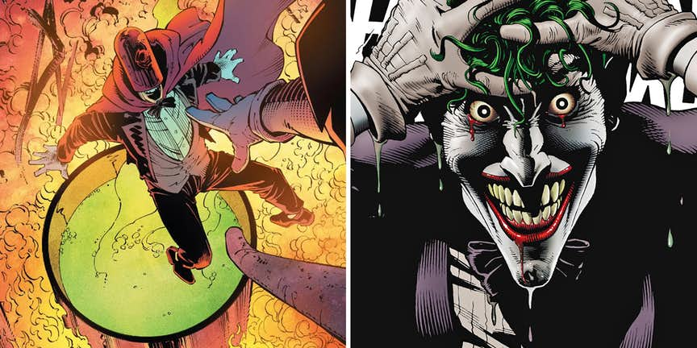

Есть несколько различных версий происхождения Джокера, но все они основываются на самой первой подобной истории, описанной в "Detective Comics #168" 1951 года. Будучи обычным криминальным элементом, персонаж столкнулся с Бэтменом на заводе Ace Chemical и в момент побега спрыгнул в чан с химикатами, которые и трансформировали его в того Джокера, которого мы знаем. В большинстве версий, именно благодаря "купанию" в химикатах кожа Джокера приобрела белый цвет, волосы - зеленый, а его разум слетел с катушек. В некоторых историях авторы винят то падение даже в его продолговатой челюсти.

## 14. Мозг

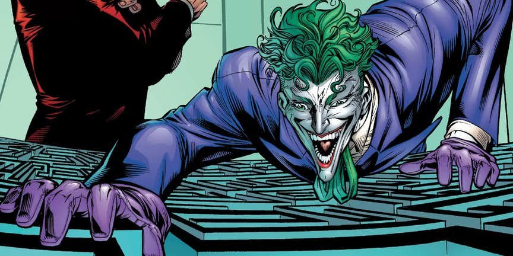

Мозг Джокера уникален. Как объяснил Марсианский Охотник в "JLA #11" 1997 года, менее рациональное правое полушарие Джокера гораздо меньше, чем аналитическое левое. Природа нестабильного психологического состояния Джокера до сих пор не ясна, но многие психологи в комиксах также относят ее к полученной травме головы во время падения в чан. В графическом романе "Бэтмен: Лечебница Аркхем" (1989), в котором у Джокера каждый день формировалась новая личность, авторы поставили своему персонажу диагноз "супер безумие".

## 13. Без лица

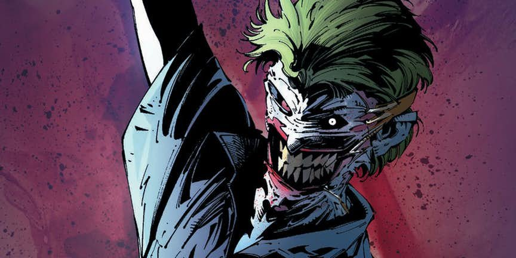

В 2011 DC перезагрузила всю супергеройскую линейку в New 52 и Джокер предстал в новом ужасном виде. В новом "Detective Comics #1" он нанял хирурга, с помощью которого срезал лицо со своей головы и прикрепил его к стенам лечебницы Аркхем. Год спустя Джокер появился в кроссовере "Смерть семьи", где с помощью подручных материалов пришил себе старое лицо, отчего стал только еще более ужасным. Когда у него выросло новое лицо, старое использовала в качестве маски его злодейка дочка.

## 12. Изобрел боевой стиль

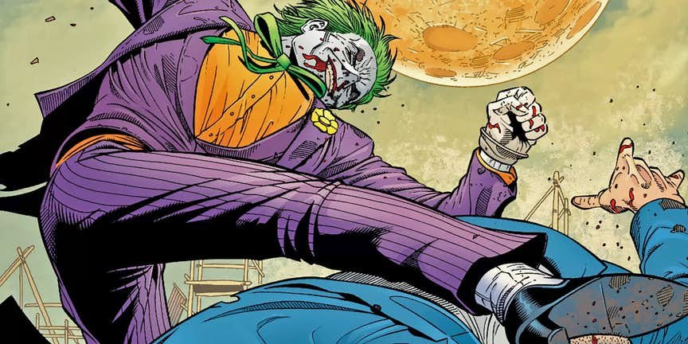

Не только мозг Джокера работает в непредсказуемом ключе, но и все остальное его тело. Не смотря на то, что он не обучался военному и боевому искусству, он всегда держался достойно в борьбе с Бэтменом - одним из лучших бойцов в мире. Джокер разработал свой уникальный стиль, который остается неуловимым для большинства оппонентов. Его техника основана на непредсказуемых комбинациях и движении, а благодаря своему телосложению, Джокер быстр и акробатичен. К тому же он не так чувствует боль (или может быть получает от нее удовольствие) , из-за чего принимает многие удары, от которых человек в здравом уме посчитал бы необходимым увернуться, но делает это лишь для того, чтобы провести более коварную и мощную контратаку.

## 11. Татуировки

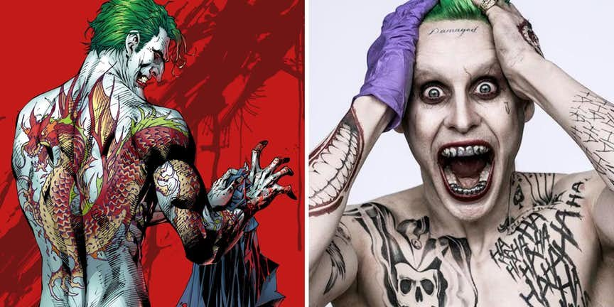

В фильме "Отряд самоубийц" 2016 года, одной из отличительных черт персонажа Джареда Лето стали его многочисленные татуировки. На лбу злодея была надпись "поврежден", а остальное тело забито надписями "ха-ха" и знакомыми изображениями усмешек и черепов в клоунских шляпах. Но эта отличительная особенность Джокера далеко не новшество. В комиксе 2008 года "All Star Batman and Robin, The Boy Wonder #8" авторы подарили Джокеру огромную тату дракона на спине, а повествование имело место быть в той же альтернативной реальности, что и "Возвращение Темного Рыцаря" 1986 года.

## 10. Улыбка

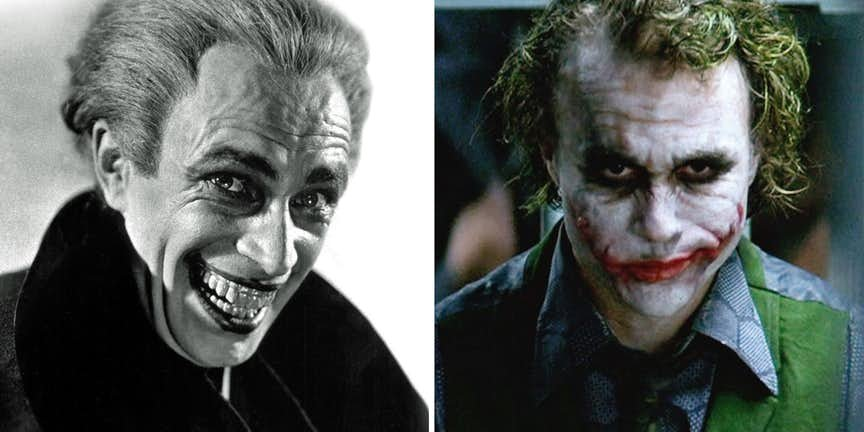

Над деталями создания персонажа спорят до сих пор, но все однозначно сошлись во мнении, что отличительная черта Джокера - улыбка - черпала вдохновение из эры немого кино. Когда персонаж создавался, Билл Фингер использовал снимок Конрада Фейдта из фильма 1928 "Человек, который смеется". По этому поводу даже есть своеобразная отсылка - графический роман 2005 года "Бэтмен: Человек, который смеется". В новом веке ухмылка Джокера подверглась значительным изменениям. В фильме "Темный рыцарь" улыбка Хита Леджера была далеко не в 32 зуба, а ее основной чертой было наличие двух шрамов по обе стороны рта. А в "Birds of Prey #124" у него даже появились вставные зубы, после того как родные ему выбила Барбара Гордон.

## 9. Иммунитет к токсинам

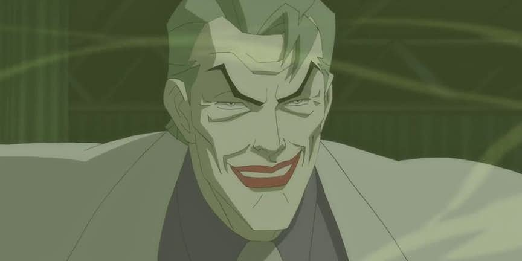

Джокеру не принадлежит звание величайшего ученного, но, благодаря его ядам, его знают как одного из лучших химиков во вселенной DC. С первого своего появления, он был замечен за смешиванием токсичных химикатов с наркотиками и веселящим газом, которые заставляли его жертв бледнеть и умирать с улыбкой на лице. Из-за продолжительного взаимодействия с собственным ядом Джокера, у персонажа развился иммунитет к нему и к множеству других токсинов. В "Detective Comics #664" (1993) на него не подействовал токсин страха персонажа Пугало, а в кроссовере "Бэтмен и Капитан Америка" (1996) Джокер остался невредимым после действия газа Красного Черепа "Пыль Смерти".

## 8. "Прокачивал" свое тело

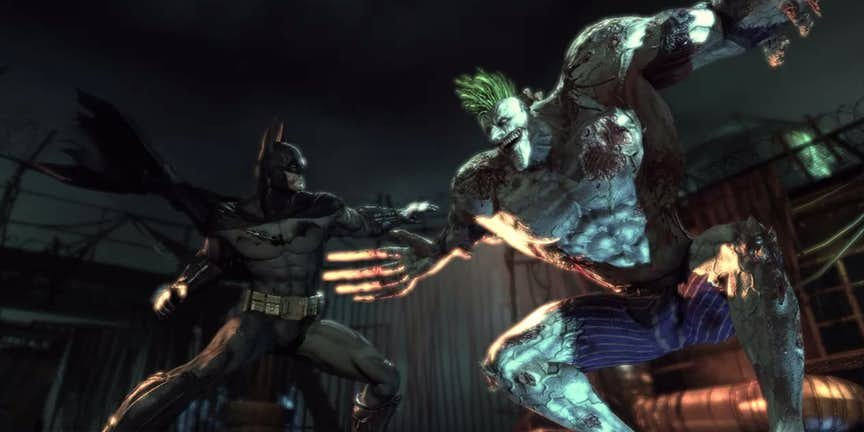

Не только у Джокера был собственный яд. Яд, который использовал Бэйн в разы увеличивал силу персонажа, и Джокер "испробовал" его на себе. Это случилось в одном из эпизодов анимационного "Бэтмена" 2005. Пару лет спустя в игре "Бэтмен: Лечебница Аркхем" (2009), он вновь прокачал свое тело, использовав Титан - смесь яда Бэйна и Ядовитого Плюща. Титан превращал людей в психов, но для Джокера это не являлось проблемой. Мускулы Джокера разрастались так быстро, что от этого рвалась его кожа.

## 7. Ядовитая кровь

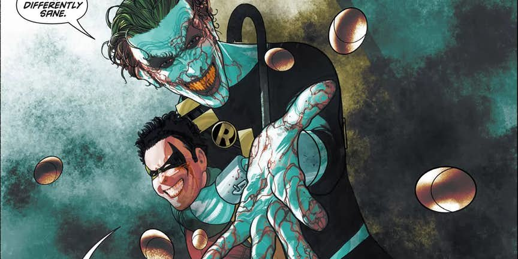

В игре "Бэтмен: Аркхем Cити" 2011 организм Джокера стал своеобразным инкубатором для Титана, который смешавшись с другими ядовитыми веществами в кровеносной системе Джокера, становился смертельным для любого, принявшего его, в течении 24 часов. В комиксах кровь Джокера опасна сама по себе. Пьющие кровь персонажа комары умирают сразу, а в "Бэтмен и Робин #14" (2010) Робина парализовало, когда во время сражения с Джокером, на него упало пара капель его крови.

## 6. Обладает регенерацией

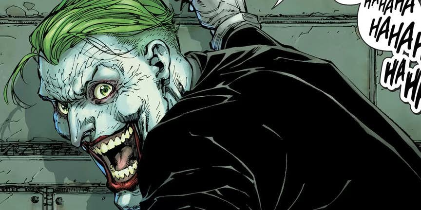

Во время многочисленных сражений с Бэтменом, Джокер получал травмы, которые убили бы любого. И не все из них можно объяснить его завышенным болевым порогом. В "Бэтмен #40" 2015, Джокер упал в источник дионезиума, благодаря чему залечил свое лицо, и на время приобрел исцеляющий фактор. В кроссовере "Endgame" того же года, Джокер исчерпал все запасы своей регенерации при залечивании многочисленных ран, полученных в битве против Бэтмена и в итоге умер.

## 5. Перенес пластическую хирургию

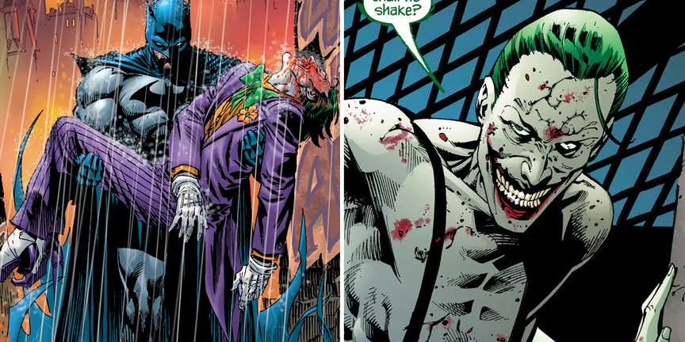

В "Бэтмене #663" (2007) Джокер перенес пластическую операцию на лице, после того как чудом выжил после выстрела в лицо от одного из фейковых героев Готэма. Вдохновленные Джокером Хита Леджера, авторы Грант Моррисон и Энди Куберт оставили на лице персонажа шрамы по обе стороны от его губ. На время Джокер даже потерял способность говорить, а на его лбу остался красный шрам от выстрела. Этот образ приклеился к персонажу на несколько следующих лет.

## 4. Был воскрешен в Яме Лазаря

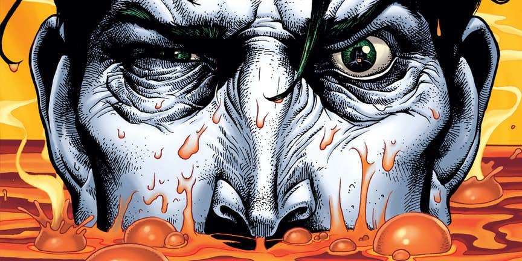

Ра’с аль Гул, которого яма поддерживала живым на протяжении столетий, не единственный противник Бэтмена,купавшийся в целебных водах. В сюжетной линии "The Demon Laughs" (2001), Джокер объединился с Ра'с аль Гулом для того, чтобы истребить большую часть населения мира смертельной инфекцией. Джокер предал напарника, за что и получил несколько пуль и был убит. В "Бэтмене: Легенды Темного Рыцаря #145" главный герой спас Джокера, поместив в его в лечебную яму. В то время как обычно яма Лазаря временно делает людей агрессивными и даже безумными, на Джокера она повлияла в противоположном ключе. Он с легкостью рассказал Бэтмену как остановить злодея от распространения вируса прежде чем вернулся к своему обыденному безумию.

## 3. Способен умело менять облик

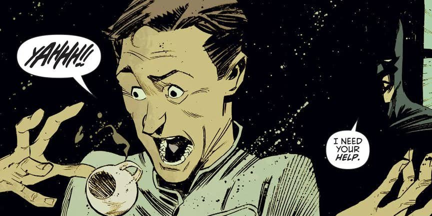

Из-за зеленых волос и абсолютно белой кожи, Джокер выделяется в любой толпе. Но он так же может очень искусно изменять свой внешний облик. Даже Джокер Хита Леджера смог выставить себя полицейским на похоронах в фильме "Темный Рыцарь". В "Batman Annual #2" (2013) нам представили Эрика Бордера - нового ординарца лечебницы, который стал близким союзником Бэтмена в Аркхеме. Через два года оказалось, что им был Джокер, который не только правдоподобно составил психологический профиль для своей новой личности, но даже использовал мышечные релаксанты, чтобы контролировать свою безумную улыбку.

## 2. Был спасен Бэтменом (снова)

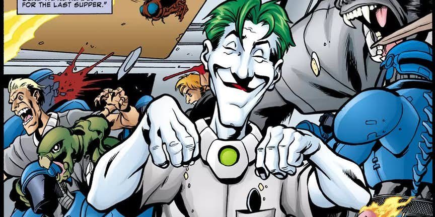

В "Последнем смехе Джокера" (2011) наш "герой" погибал от опухоли мозга. Узнав об этом от тюремного врача, он решил "уйти" громко хлопнув дверью и заразил всех суперзлодеев в тюрьме ядом Джокера, а потом начал сеять хаос во всем мире. В последствии оказалось, что врачи обманули его с диагнозом, в попытке изменить персонажа. Но Джокер все равно умер на пару секунд, когда Найтвинг не хило избил его. Быстро подоспевший Бэтмен сделал злодею искусственное дыхание, спас его, и вернул в тюрьму.

## 1. Его безумие не вечно

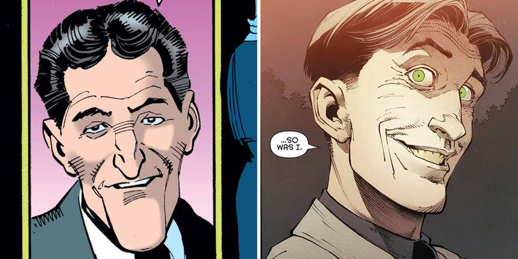

Вы не поверите, но Джокер несколько раз превращался в совершенно обычного человека. В комиксе "Бэтмен: Легенды Темного Рыцаря #65" Джокер посчитал, что наконец убил Бэтмена и его сумасшествие быстро испарилось. Он стал законопослушным гражданином, вылечил кожу и даже обручился. В 2016 Джокер пережил аналогичную трансформацию в комиксе "Бэтмен #47". Он снова попал в дионезиум и его разум и тело исцелились. В обоих случаях безумный дух Джокера возвращался к персонажу, после появления Бэтмена.
