Сегодня я хочу представить вам перевод статьи одного зарубежного портала о 15 самых мощных костюмах Бэтмена.

Одна из причин любви фанатов к Бэтмену, это то что он обычный человек, который превратил себя в нечто невероятное. У него нет суперсилы или скорости, он даже не пуленепробиваемый, но у него есть тактический гений, натреннированное тело и железная воля.

Железный человек известен своими костюмами, и тем, что на каждый случай у него есть особый костюм, но он не единственный, кто готов ко всему. Бэтмен создал огромное количество экипировки для сражения с противниками, особенно, если те сильнее его. Раз уж у него нет суперспособностей, он должен использовать все, что может достать.

## 15 место. Костюм Бэтмена Будущего

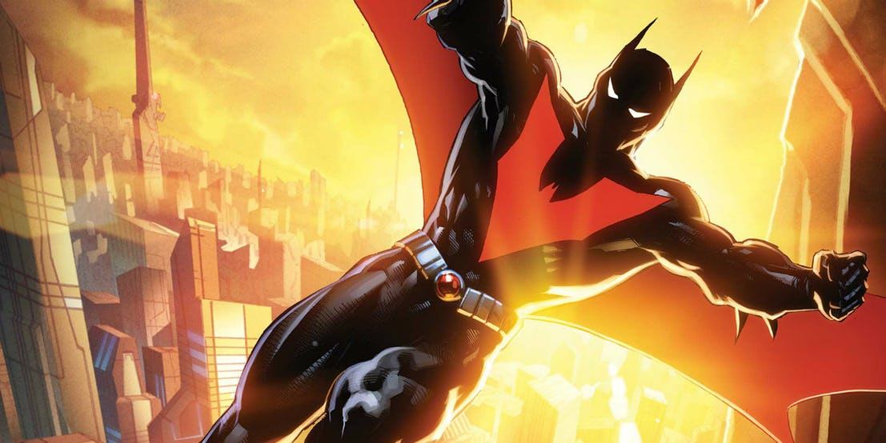

Начавшись как мультсериал в 1999 году, Бэтмен будущего был киберпанком во вселенной Бэтмена, созданный Брюсом Тиммом, Полом Дини и Алом Бернетом. Нам представили отдаленное будущее, 2039 год, постаревший Брюс Уэйн передал свой костюм подростку Терри МакГиннесу. С наставником в виде Брюса, Терри сражался с новыми злодеями, такими как Инк, Шрик и другие.

Несмотря на то,что костюм был создан в 2019 году, в 2039 он все еще был полностью боеспособным. В нем были крылья, режим невидимости, набор гаджетов. Также он выступал в роли экзоскелета, повышая силу и скорость владельца.

## 14 место. Бэт-Бот

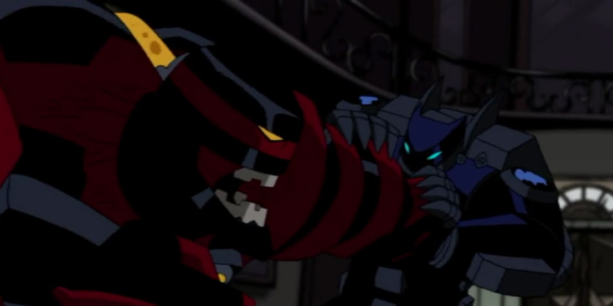

В одном из эпизодов мультсериала 2004 года, была представлена новая версия одного из самых знаменитых противников Бэтмена. Написанный Адамом Биченом и срежиссированный Сэмом Лью эпизод начинался с того, что боссы мафии нанимают загадочного наемника, известного как Бэйн. Эпизод был облегченной версией арки 1993 года “Knightfall”, где Бэйн избил Бэтмена и бросил его умирать. Чтобы одолеть Бэйна, Бэтмен создает броню Бэт-Бот.

Бэт-Бот это экзоскелет, который делает Брюса больше в размерах, чтобы сравняться с Бэйном. Также в него установлены вспомогательные моторы, которые придают ему сверхчеловеческую силу. Еще в нем установлен джетпак, позволяющий пролетать короткие дистанции или замедлять падение со зданий. Но все это не помешало Бэйну вскрыть этот костюм, как консервную банку, к счастью Бэтмен успел схватить силовой кабель и устроить Бэйну шок всей его жизни.

## 13 место. Доспех Скорби

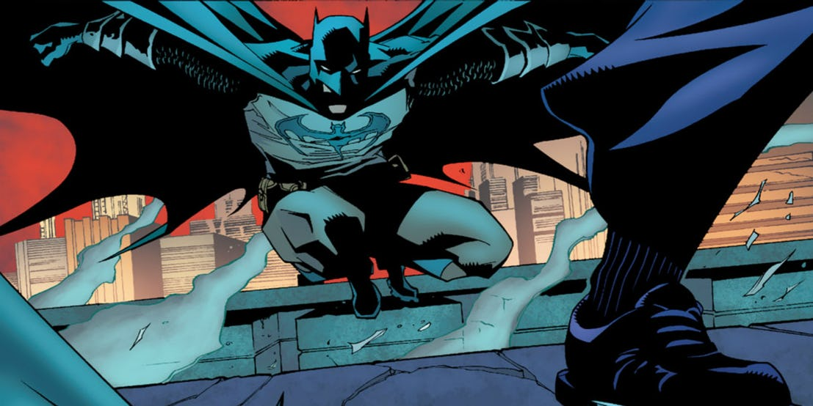

Броня, известная как Доспех Скорби, впервые появилась в Детективных комиксах #838 2008 года, написанном Полом Дини и нарисованном Райаном Бенджамином. Подаренный Талией Аль Гул, дочерью древнего злодея Рас Аль Гула, Доспех Скорби появился в 1190 году, во время крестовых походов. Доспех свел с ума первого одевшего его рыцаря, заставив его зарезать сотни людей, но это не отпугнуло Бэтмена.

Доспех скорби был выкован из клинков и нагрудников падших солдат Ордена Чистоты, подразделения Ордена святого Дюмы. Бэтмен заметил,что костюм делает его быстрее и сильнее, но также и более жестоким. Он решил прекратить носить эту броню, но не смог заставить себя уничтожить ее и оставил ее в бэтпещере. Доспех был украден Орденом святого Дюмы и передан новому Азраилу.

## 12 место. Экзоброня из Возвращения Темного Рыцаря

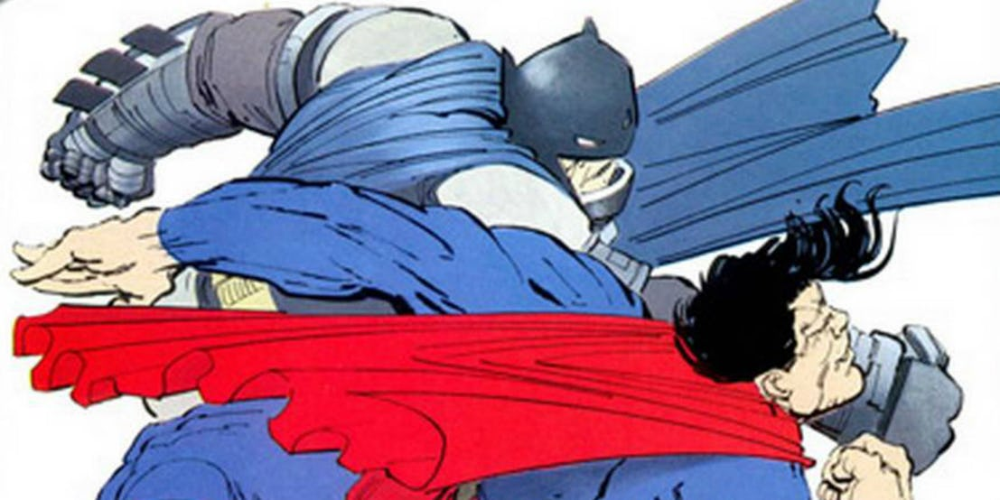

В 1986 Фрэнк Миллер представил нам более темного и жесткого Бэтмена, постаревшего и уставшего, но вышедшего из тени, для борьбы со старыми и новыми угрозами. Одной из этих угроз стал Супермен, управляемый коррумпированным правительством США. Когда оно решило, что пора остановить Бэтмена, Супермен получил приказ разобраться с ним. Но Брюс был готов.

Бэтмен создал экзоскелет специально для схватки с Суперменом, с броней, достаточной, чтобы выдержать удары Человека из Стали, и экопированную двигателями, чтобы сделать удары Бэтмена сильнее. Костюм так же позволил ему провести через череп Супермена огромный разряд электричества и распылить яд, чтобы отвлечь его. Это один из самых известных костюмов, он даже появился на большом экране в фильме Бэтмен против Супермена: на заре справедливости.

## 11 место. Костюм Хищника

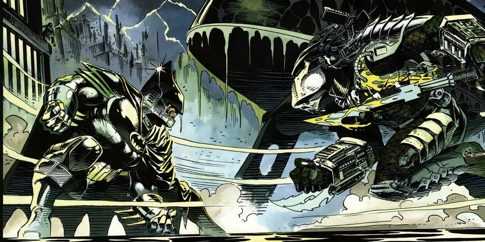

В 1991 году Бэтмен столкнулся с Хищником в сюжете “Бэтмен против Хищника”, написанном Дэйвом Гиббонсом и нарисованном Энди Кубертом. В первой книге Бэтмен расследовал чудовищное убийство боксера, у которого были вырваны позвоночник и череп. Сначала Бэтмен решил, что это война банд, но затем понял, что в Готэме объявился инопланетный Хищник. Чтобы одолеть его, Бэтмен разработал экзоскелет.

Он был разработан специально, для борьбы с Хищником. Чтобы компенсировать невидимость пришельца, был установлен сонар, дополнительная физическая сила, для схваток врукопашную и броня, для защиты от острых клинков Хищника. В итоге Бэтмен настолько избил Хищника, что тот запустил протокол самоуничтожения и назвал Бэтмена величайшим воином во вселенной (а то мы не знали).

## 10 место. Костюм Молотильщика

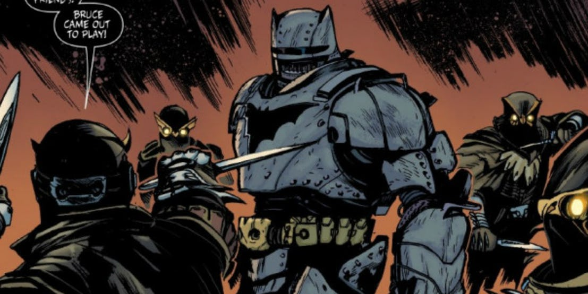

В 2012 Бэтмен узнал о секретной организации “Двор Сов”. Ночь Сов - история, в которой Двор Сов отправляет Когтей, чтобы разобраться с Бэтсемьей и укрепить свое влияние. В 8 выпуске Бэтмена за авторством Скота Снайдера и рисунком от Грега Капулло, они ударили в самое сердце семьи, по Брюсу Уэйну. Они вошли в поместье Уэйнов и нашли путь в Бэтпещеру, но Бэтмен был готов... потому что он Бэтмен.

Главным оружием когтей является их регенеративные способности, позволяющие не обращать внимания на раны и даже воскрешать их. Чтобы одолеть их, Бэтмен понизил температуру в помещении ниже нулевой, но до их заморозки ему нужно было продержаться несколько минут. Поэтому он облачился в экзоскелет колотильщика, который не только позволяет выживать при отрицательных температурах, но и повышает силу и бронирован, для схватки с Когтями без подкрепления.

## 9 место. Броня Троицы

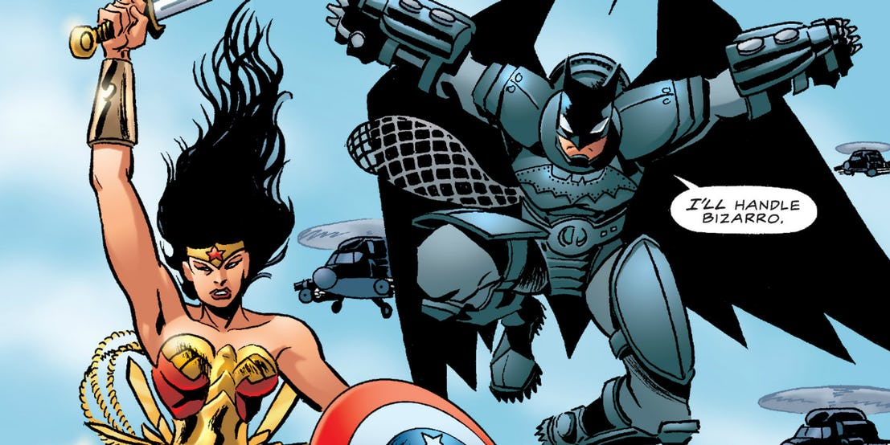

Написанный и нарисованный Мэттом Вагнером комикс “Бэтмен/Супермен/Чудо-женщина: Троица” рассказывал о первой встрече величайших героев ДиСи. Она повествует о том как Рас Аль Гул, Бизарро и Артемида работали вместе, чтобы ввергнуть мир в хаос, и героем пришлось объединиться, чтобы противостоять тройной угрозе. Обычно с Бизарро бился Супермен, но в третьем выпуске Бэтмен сошелся с ним один на один, и он был готов к этому.

Как и все его экзоскелеты, броня Троицы делала Бэтмена сильнее и быстрее, а также защищала от ударов Бизарро. Но этой брони оказалось мало, и Бизарро смог повредить ее грудную часть, так что Бэтмен не мог дышать, а Чудо-женщине пришлось доставать его оттуда. Так же броня была оснащена гаджетами, такими как титановая сеть под напряжением, запас мини гранат и лазеры, встановленные в перчатки. Этого было недостаточно, чтобы победить Бизарро, но хватило на отвлечение, пока не прибыл Супермен.

## 8 место. Броня проекта Бэтмен

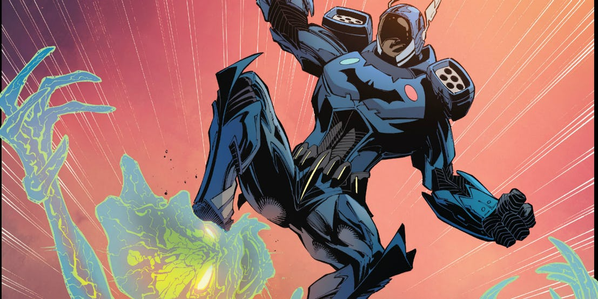

В завершении истории Скотта Снайдера и Грега Капулло в #40 выпуске Бэтмена 2014 года, Бэтмен погибает от рук Джокера. С трагической смертью Бэтмена, Готэм теряет своего защитника. Чтобы заполнить эту пустоту, Пауерс Интернэшнл снаряжает комиссара Гордона на замену Бэтмена. Чтобы компенсировать отсутствие опыта и навыков, ему выдают комплект брони.

Броня, известная как проект Бэтмен, дает обычный набор из силы, скорости и прочности, но также имеет пару козырей в рукаве. Например согласованность с полицией Готэма, так что он всегда на связи с дирижаблем полиции и взаимодействует с местными властями. Он может швырять бэтаранги и даже выдавать ЭМП разряд. Еще у него есть магнитные ботинки, дающие невероятную цепкость. Гордон никогда не был более боеспособен, чем в этом костюме.

## 7 место. Бэткостюм ДиСи один миллион

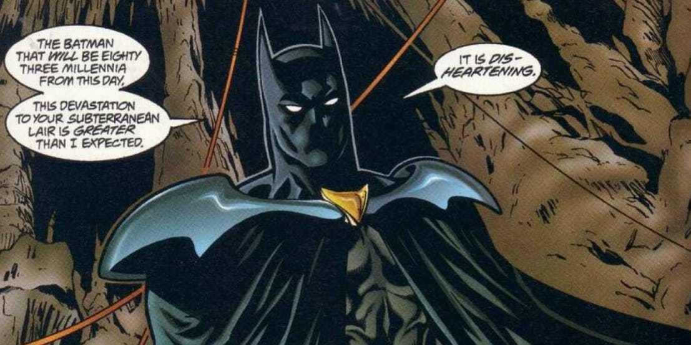

23 выпуск Лиги Справедливости Америки за авторством Гранта Моррисона и рисунком Хорварда Поттера представил нам Бэтмена вселенной ДиСи один миллион, которая показывает нам события далекого будущего. Бэтмен в этой вселенной родился в 853 веке, на планете тюрьме Плуто, которую захватил преступник Ксаурон, который убил тысячи жителей на глазах их детей. Одним из этих детей и был Бэтмен, который решил более не допустить несправедливости.

Бэткостюм один миллион сделал огромный скачок вперед. С виду он не сильно отличается от классического костюма. В нем составная броня, огнеупорный плащ и усиленный каркас. Так же в нем есть ночное виденье, камуфляж для стелса. Бэткомпьютер встроен в костюм.

## 6 место. Броня Бэтвинга

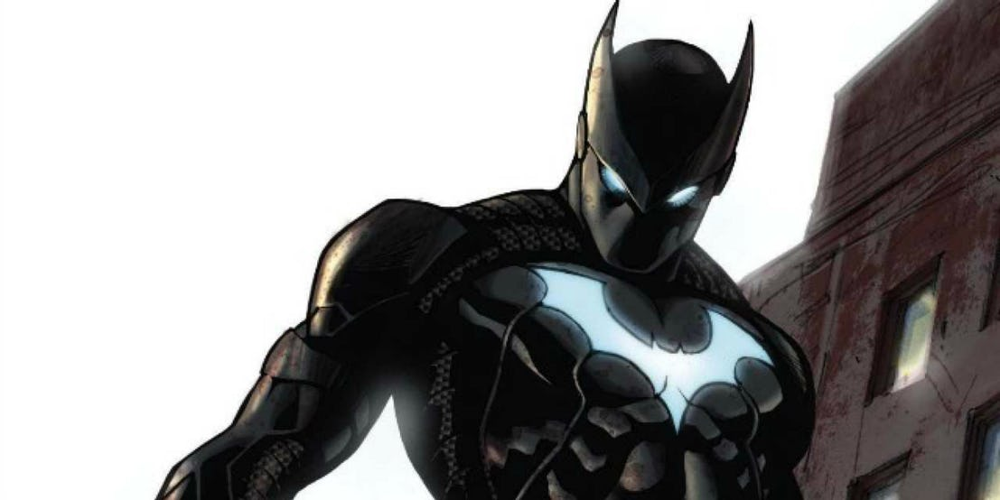

Дэвид Завимбе был типичным ребенком солдатом, пока не стал африканской версией Бэтмена в своей сольной серии в 2011 году. Он стал частью Корпорации Бэтмен. Основанной чтобы бороться с преступностью по всему миру.

Первая версия костюма получила стандартное трио: силу, скорость и прочность, а также джет пак для полетов. Второй Бэтвинг Лукас Фокс привнес в костюм апгрейды. Так он получил ряд медицинских улучшений. Например костюм мог определить сломанные кости и уплотнится в этой области, пока человек не получит медицинской помощи. Он не мог летать, но отлично мог парить.

## 5 место. Стелс костюм

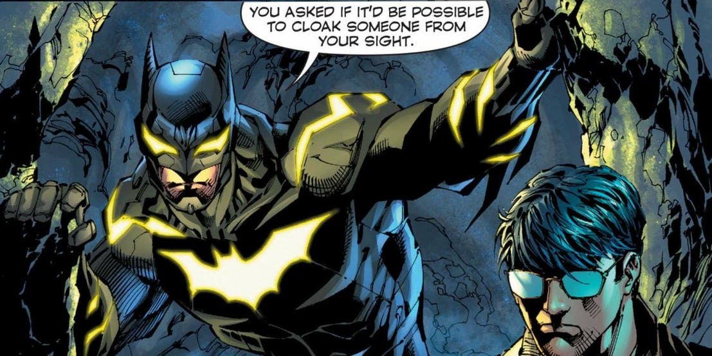

Когда мы говорим о способностях, мы говорим не только о грубой силе. Также есть способность прятаться и становится невидимым, а это работа номер 1 для Бэтмена, раз уж у него нет кучи суперспособностей. Его уязвимость делает его параноиком (будем называть это обеспокоенностью) насчет Супермена, у которого есть куча суперспособностей и очень мало слабостей. Во втором выпуске Супермен непобежденный, за авторством бога нашего Скота Снайдера и с рисунком от Джима Ли, Скотта Уильямса и Дастина Нгуены, мы увидели его стелс костюм, разработанный для защиты от Человека Завтрашнего Дня.

Когда Супермен прилетел в Бэтпещеру, он был удивлен, что нигде не видит Бэтмена. Тот представил стелс костюм, который подстраивается под любую вещь, которая пытается его обнаружить. Даже рентген зрение Супермена не может обнаружить его. Костюм также бронирован, что помогло Бэтмену сразится с Гневом. А со всеми этими линиями он выглядит чертовски круто.

## 4 место. Костюм Инсайдера

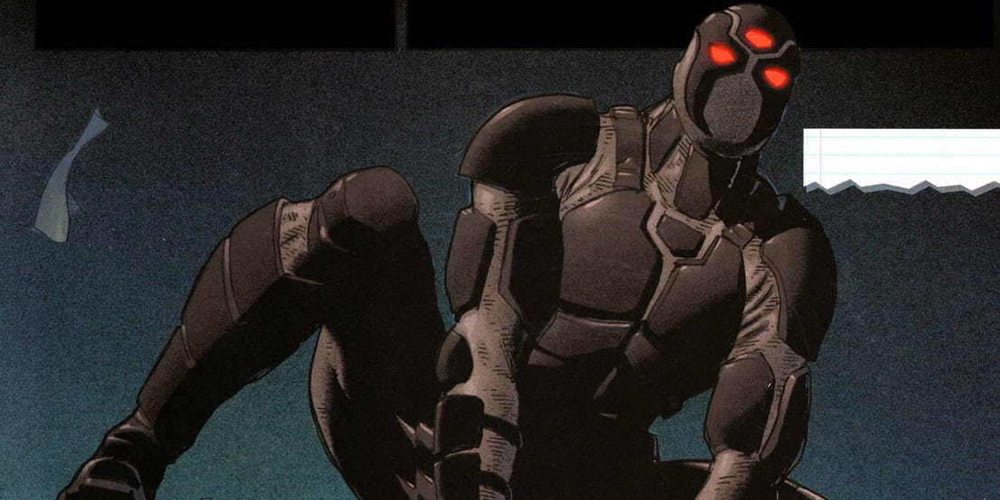

В 2010 году жизнь Бэтмена стала довольно сложной, его только что чуть не убили во время Последнего кризиса, отправив его в путешесивие в настоящее из далекого прошлого. Тем временем его плащ взял Дик Грейсон, и Бэтмен решил не появляться, а посмотреть как дела идут без него. Впервые он появился в комиксе Брюс Уэйн:Дорога домой:Бэтмен и Робин 2010 года, Уэйн стал Инсайдером и надел новый костюм.

Костюм сочетал в себе способности лиги справедливости: лазеры из глаз, скорость Флэша, маскировку Марсианского охотника и другие. Также он мог летать и телепортироваться. Не было только ушей и лого.

## 3 место. Бэтмен Мэнбет

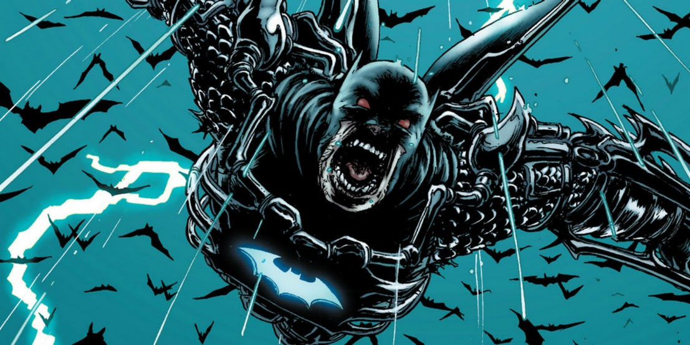

В 2013 году Грант Моррисон представил нового Бэтмена в 12 выпуске Корпорации Бэтмен. В этом выпуске герой сталкивается с Талией Аль Гул и армией ниндзя, наполовину превращенных в летучих мышей, а также клона способного убить Бэтмена. Для сражения с ними Бэтмен принимает сыворотку Мэнбета.

Также он одевает Доспех скорби, о котором говорилось раннее. Плюс джетпак. Брюс превращается в монстра, чтобы сражаться с монстрами.

## 2 место. Броня Хэллбэт

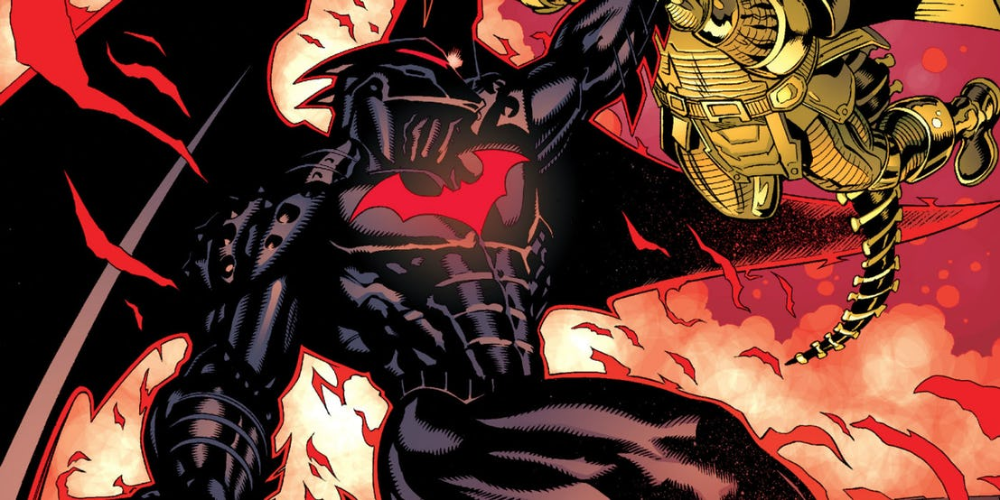

В 33 выпуске Бэтмена и Робина нам показывают Хэллбэт, один из самых мощных костюмов Бэтмена. Так как Бэтмен один из немногих членов Лиги Справедливости без суперсил, броню ему делали всей Лигой. Расплавленная Суперменом на солнце и выкованная Чудо-женщиной на Олимпе, собранная Киборгом, подогнанная Зеленным Фонарем, закаленная Флэшем и Акваменом, Хэллбэт выглядит идеальным оружием.

Скорость, сила и прочность. Огромное количество дополнительных способностей, например невидимость, полет. Из минусов стоит отметить. Что пребывание в нем слишком долго может убить Брюса. Он использовал его лишь однажды, чтобы забрать.тело сына с Апокалипса, и это была цена которую он готов был заплатить.

## 1 место. Джастис Бастер

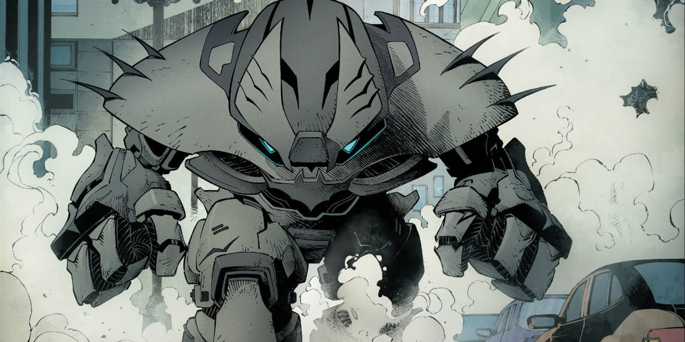

Есть старая поговорка: если ты параноик, это еще не значит, что люди вокруг тебя не хотят убить тебя. Как мы уже выяснили Бэтмен не доверяет никому и иногда он прав. Что и подтвердилось в 2016 году в первом номере арки Бэтмен Конец игры от божественного дуэта Скота Снайдера и Грега Капулло, в котором случился худший сценарий, Джокер отравил Лигу справедливости и обратил против Бэтмена.

Он одел броню созданную против Лиги. Он избавился от Чудо-женщины с помощью Повязки покрова, одолел Флэша на гиперскорости, против Аквамена использовал спрей, вызвав дегитрацию, Киборг получил электроразряд, Зеленый фонарь получил “жеотый нейтрализатор”. Но самое интересное он приберег для супермена. Перчатки с мини красными солнцами, покрытие от лазеров и ледянного дыхания, а на сладкое жвачка с криптонитом. Так кто же мог уложить самых могущественных существ на земле？Бэтмен, вот кто!

[Оригинал](http://www.cbr.com/batmans-15-most-powerful-suits/)