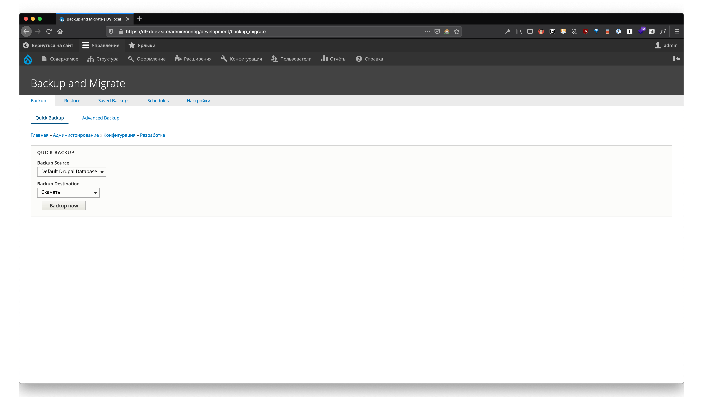
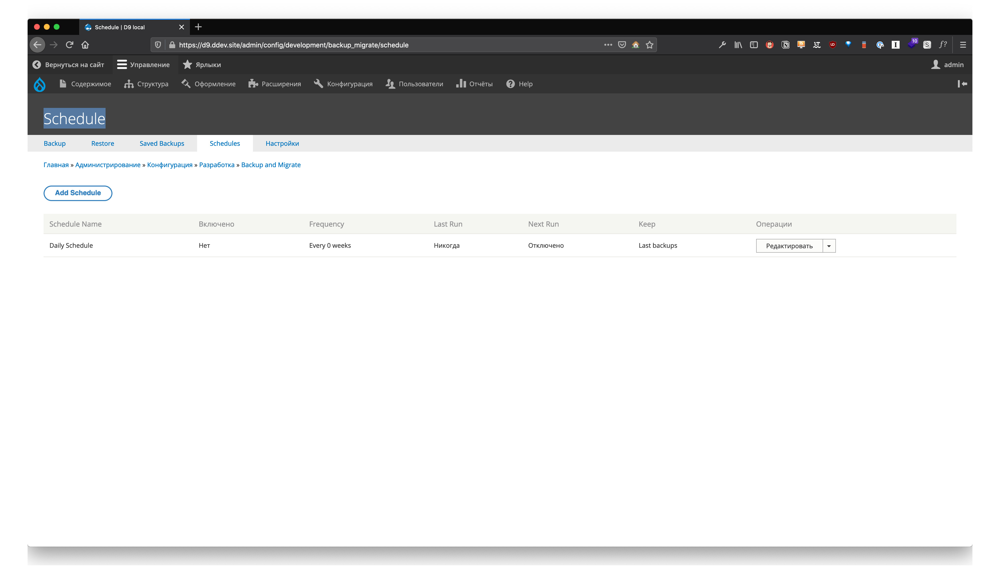
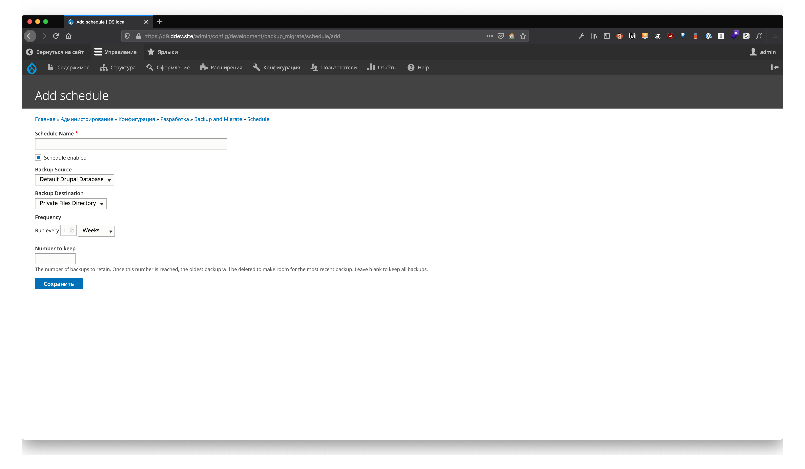

У Drupal разработчиков есть несколько путей для резервного копирования сайта. В этой статье я расскажу вам про два способа. Первый с использованием модуля [Backup and Migrate](https://www.drupal.org/project/backup_migrate). А для второго способа нам понадобится: терминал, drush и cron. 

## Способ первый, Backup and Migrate
С помощью этого модуля можно создавать резервные копии как базы данных, так и файлов. Можно и все целиком копировать. Модуль имеет функцию шифрования, но для этого вам нужно поставить дополнительную PHP библиотеку **Defuse PHP encryption**.

```bash
composer require defuse/php-encryption
```

### Погнали
- Устанавливаем модуль [Backup and Migrate](https://www.drupal.org/project/backup_migrate)
- Создайте каталог личными файлами (private directory) и назначьте ему права на запись (аналогично тому, что мы даем папке с файлами)
- Задайте путь к личному каталогу в файле **settings.php**, чтобы модуль мог использовать его для хранения резервных копий. 



После установки модуля перейдите в **Администрирование -> Конфигурация -> Разработка -> Backup and Migrate**. Вы увидите 5 вкладок: 
- **Backup** — здесь вы сможете сделать быстрое резервное копирование. После того, как вы нажмете «Backup now», вы сможете увидеть его на вкладке «Saved Backups».
- **Restore** — тут вы сможете восстановить свои данные.
- **Saved Backups** — тут будет список всего что вы набэкапили.
- **Schedule** — расписание. Именно то, что нам нужно. Тут можно будет настроить бэкапы по расписанию.
- **Settings** — есть подозрение, что вы сами догадаетесь, что же тут. Но если вдруг нет, то тут настройки модуля. 

### Расписание
Это пожалуй единственная на самом деле нужная нам функция модуля. Тут мы настраиваем планировщик наших бэкапом. Они запускаются автоматический по cron’у. Вы можете добавить сколько угодно задач которые будут выполняться по расписанию. Бэкапить можно базу данных, файлы или весь сайт целиком.



### Настройка бэкапов по расписания
Здесь вы можете создать задачи, которые будут выполняться по, пам пам пам, расписанию. Любые созданные вами задачи, вы можете включить или выключить. При создании задачи вы можете:
- задать ей имя
- выбрать, что копировать
- выбрать куда копировать, кстати места куда копировать можно настроить
- периодичность с какой копировать
- а параметр *Numbers to keep* позволит вам указать, сколько копий хранить.

Не большой хинт: если вы хотите бэкапить базу данных в несколько разных мест, то проще всего будет создать несколько задач у которых указать разные пути хранения.



### Есть ли ограничения?
К сожалению, да. Если ваша база данных вырастет до размера слона, то могут возникать Time-out ошибки. Это не большая конечно проблема если вы используете свой сервер. Но на обычном хостинге может быт большой проблемой, не вак что вы сможете увеличить максимальное время выполнения. Другая проблема в памяти. Иногда ее тоже может не хватить. Если вы уперлись в потолок, то посмотрите на второй метод с использование CLI.

## Способ второй, CLI
В этом способе мы можем выполнять резервное копирование двумя путями:
- Используем [Drush](https://www.drush.org/) и [Crontab](https://losst.ru/nastrojka-cron)
- Использование нативные команды и Crontab

### Используем Drush и Crontab
Например мы хотим каждый день в 3 утра бэкапить базу данных сайта. Тут все просто:

```bash
0 3 * * * <path-to-drush> -r <path-to-drupal-root> sql:dump --result-file=<filename>.sql --gzip
```

Ну или чтоб совсем понятно, вот пример:

```bash
0 3 * * * /var/www/html/drupal_demo/vendor/drush/drush/drush -r /var/www/html/drupal_demo sql:dump --result-file=/var/www/html/drupal_demo/db-dump-`date +%d%m%Y%H%M%S`.sql --gzip
```

Раньше Drush умел еще и файлы бэкапить, а сейчас либо я и автор дураки, либо он разучился. Но переживать не стоит. Это все можно сделать нативными средствами линукса.

### Использование нативных команд и Crontab 
Опять же мы хотим каждый день в 3 утра бэкапить базу данных сайта, но без Drush. Тут все просто:

```bash
0 3 * * * mysqldump -u <mysql_username> -p <mysql_database_name> | gzip -c > <path-to-filename>.sql.gz
```

Привет:

```bash
0 3 * * * mysqldump -u drupal -p drupal_demo | gzip -c > /var/www/html/drupal_demo/db-dump-`date +%d%m%Y%H%M%S`.sql.gz
```

Ну, а что же с файлами? Тут все точно также. Мы хотим каждое утро в 5 часов бэкапить файлы:

```bash
0 5 * * * tar -czvf <path-to-backup-filename>.tgz <source>
```

Пример:

```bash
0 5 * * * tar -czvf /home/ubuntu/backups/drupal_demo-files-`date +%d%m%Y%H%M%S`.tgz /var/www/html/drupal_demo/web/sites/default/files/
```

Собственно все, мы молодцы и все настроили! 

Все это вольный пересказ оригинальной статьи [How to perform Automated Backups on a Drupal 8 (or 9) Website](https://www.specbee.com/blogs/how-to-perform-automated-backups-on-drupal-8-or-9-website).
