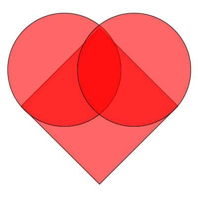

import { YouTube } from 'astro-embed';
import CodePen from '@/components/CodePen.astro';

Каждый год 14 февраля многие люди обмениваются открытками, конфетами, подарками или цветами со своей особой «валентинкой». День романтики, который мы называем Днем Святого Валентина, назван в честь христианского мученика и восходит к 5-му веку, но берет свое начало в римском празднике Луперкалия.

Пока все хорошо. Но что может сделать программист для своей валентинки?

Мой ответ: использовать CSS и быть креативным!

Я люблю CSS. Это не очень сложный язык (в большинстве случаев он даже не считается языком программирования). Но с некоторой геометрией, математикой и некоторыми основными правилами CSS, вы можете превратить ваш браузер в основу своего творчества!

Итак, начнем. Как бы вы создали сердце с помощью геометрии?



Вам просто нужен квадрат и два круга. Правильно?

Мы можем нарисовать это одним элементом, благодаря псевдоэлементам `::after` и `::before`. Говоря о псевдоэлементах, `::after` - это псевдоэлемент, который позволяет вставлять контент на страницу из CSS (без необходимости HTML). `::before` - то же самое, только он вставляет контент перед любым другим контентом в HTML, а не после.

Для обоих псевдоэлементов конечный результат фактически отсутствует в DOM, но он появляется на странице так, как если бы он был.

Итак, давайте создадим наше сердце.
```css
.heart {
  background-color: red;
  display: inline-block;
  height: 50px;
  margin: 0 10px;
  position: relative;
  top: 0;
  transform: rotate(-45deg);
  position: absolute; 
  left: 45%; top: 45%;
  width: 50px;
}

.heart:before,
.heart:after {
  content: "";
  background-color: red;
  border-radius: 50%;
  height: 50px;
  position: absolute;
  width: 50px;
}

.heart:before {
  top: -25px;
  left: 0;
}

.heart:after {
  left: 25px;
  top: 0;
}
```

Вы можете заметить, что мы определяем квадрат и его расположение, используя основной класс `heart` и два круга с псевдоэлементами `::before` и `::after`. Круги - это лишь 2 квадрата с `border-radius` 50%.

Но что такое сердце без биения?

Давайте создадим его. Мы будем использовать правило `@keyframes`. CSS-правило `@keyframes` используется для определения поведения цикла CSS-анимации.

Когда мы используем правило ключевых кадров, мы можем разделить период времени на более мелкие части и создать преобразование/анимацию, разделив его на этапы (каждый шаг соответствует проценту от завершения периода времени).

Итак, давайте создадим сердцебиение. Анимация сердцебиения состоит из 3 шагов:
```css
@keyframes heartbeat {
  0% {
    transform: scale( 1 );    
  }
  20% {
    transform: scale( 1.25 ) 
      translateX(5%) 
      translateY(5%);
  } 
  40% {
    transform: scale( 1.5 ) 
      translateX(9%) 
      translateY(10%);
  }
}
```

1. 0% начинаем без трансформации
2. 20% уыеличиваем масштаб до 125%.
3. 40% увеличиваем масштаб до 150% от первоначального размера.

В остальные 60% времени возвращаем наше сердце в исходное состояние.

Назначаем анимацию нашему сердцу:
```css
.heart {
  animation: heartbeat 1s infinite; // наше сердце будет биться безконечно
  ...
}
```

Вот и все!

Весь пример на Codepen:

<CodePen id="vdJvex" />

[Оригинал](https://medium.freecodecamp.org/how-to-create-a-beating-heart-with-pure-css-for-your-valentine-2aeb05e2d36e)
