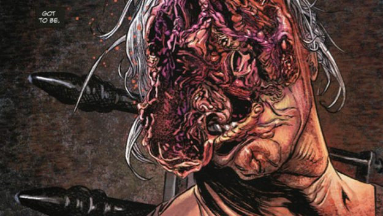
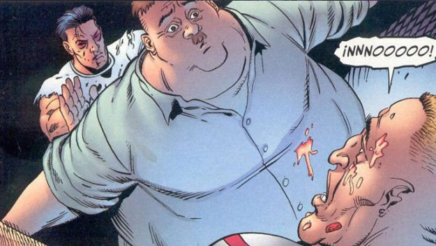
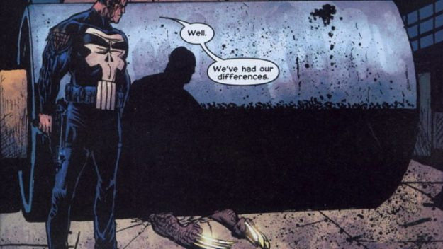
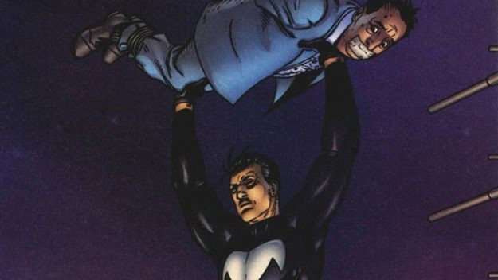
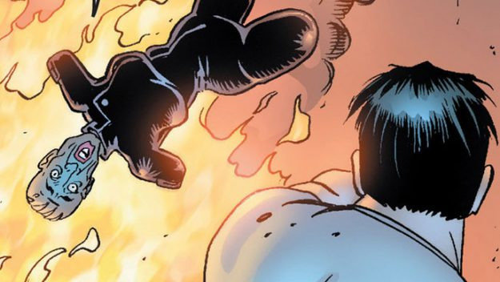
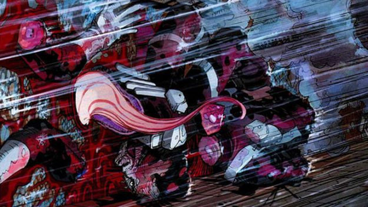
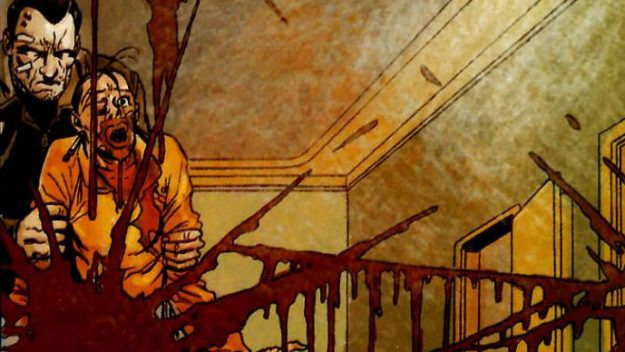
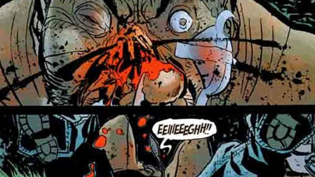
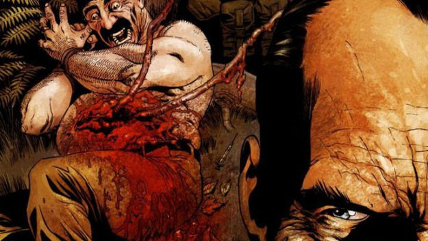
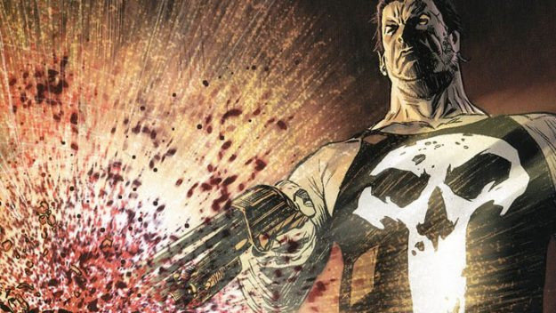

ТВ адаптация комикса о Карателе уже доступна для просмотра. Казалось бы, в современном мире, где каждый день кто-то в кого-то стреляет, трудно удивить персонажем с кучей стволов. В этом вся магия комиксов - наш герой убивает только плохих парней. Фрэнк Касл может расправиться с преступником из любого оружия, которое попадется ему под руку, но иногда ситуация требует от него смекалки. В данной статье вы прочитает о самых шокирующих и ужасных убийствах героя. Слабонервным лучше не читать.

## Кончина Питси

В основном, убийство бандитов у Фрэнка занимало не так много времени. Но с Кармином "Питси" Газзера пришлось повозиться. Драка проходила в здании, и в один момент Каратель выбросил мафиози из окна, но Питси, тело которого было в буквальном смысле насажено на железный забор, чудесным образом удалось выжить. Враг был обездвижен, и Фрэнк добил его выстрелом из дробовика в лицо.

## Смерть "Русского"

Криминальный авторитет Ма Ньюччи наняла солидного наемного убийцу, по кличке "Русский", и отправила убить Карателя. Когда тот выследил Фрэнка, то напал на него в его квартире. В процессе драки они проломили стену и оказались в квартире у увесистого соседа - мистера Бампо. Касл повалил русского, ударив его горячей пиццей по лицу, а затем опрокинул на него огромного соседа и держал, пока убийца не задохнулся. Потом он, кстати, отрезал его голову и отослал заказчику.

## Росомаха под катком

Это сложно назвать "убийством", потому что, как мы знаем, Росомаха обладает способностью к регенерации, а скелет его сделан из адамантия. Но когда Фрэнк столкнулся с Росомахой, то ему пришлось применить более креативный подход. Сначала он выстрелил ему в лицо из дробовика, оставив один лишь голый череп, потом выстрелил в пах, и после этого наехал на его тело катком. Росомахе оставалось лишь ждать, пока кто-то не придет на помощь. Как долго, никто не знает.

## Эмпайр-стейт-билдинг

В одном из выпусков, Фрэнк Касл рассказывает своими словами о том, как стал уличным линчевателем, какому-то неизвестному человеку. Этим слушателем оказывается преступник из не особо высоких кругов, которого Фрэнк на протяжении всей истории тащил на крышу небоскреба, чтобы потом отпустить на встречу смерти. Мужик, в Нью-Йорке полно зданий, почему ты выбрал самое известное?

## Сожжение Ма Ньюччи

Фрэнк думал, что избавился от преступницы еще когда бросил ее в клетку к белым медведям. Но Ньючии удалось выжить, правда ценой рук, ног и немного головы. Даже в таком состоянии она посылала убийц за Карателем, в результате чего, Фрэнк пришел к ней в особняк и сжег его вместе с ее беспомощным телом.

## Порезанный на кусочки

Давайте немного затронем событие, когда Фрэнк оказался не на стороне победителя. В серии комиксов "Темное правление" Норман Осборн формирует собственную команду Темных Мстителей, с одним из членов которой - Дакеном, Фрэнку пришлось встретиться лицом к лицу. Дакен, являясь сыном Росомахи, обладал способностью к регенерации, что в итоге сыграло ключевую роль. Каратель проиграл бой и был порезан на мелкие кусочки.

## Удар о стекло

Что не может не радовать в Карателе - то что его ужасное возмездие приходится на людей, которые этого заслуживают. Отличный пример - Вера Константин - лидер преступной организации, похищающей девушек с целью использования их в сфере проституции. Скрываясь в здании с пуленепробиваемыми стеклами, она думала, что находится в безопасности. Конечно, убив всех ее охранников, Касл добрался до нее, и бил об стекло до тех пор, пока оно не вылетело из рамы. За стеклом отправилась и преступница.

## Встречи с Барракудой

Сражения Фрэнка с массивным гангстером Барракудой всегда были одними из самых жестоких. При первой их встрече, Фрэнк оставил упыря без глаза и пальцев правой руки. Что конечно привело к многочисленным попыткам мести. Кульминацией стало похищение дочки Карателя (о существовании которой он не знал) и убийство девочки у него на глазах. Фрэнк в упор разрядил АК-47 в лицо Барракуды.

## Здоровый кишечник

Когда Фрэнк отслеживал Веру, к нему в руки попал один из ее подчиненных. Когда ты сначала стреляешь, а потом спрашиваешь, у тебя вряд ли получиться добыть информацию. Поэтому Касл вырубил мужика, разрезал его живот и, достав оттуда кишечник, привязал его им к дереву. Пожалуй, мужик отделался легче, чем его босс.

## Каша из головы

С друзьями всегда тяжело прощаться. В одной из серий комиксов, союзник Карателя и поставщик оружия, Микрочип, отвернулся от Фрэнка и начал работать на правительственную организацию, которая, как оказалось, спонсировалась сетью наркоторговцев. Когда Касл узнал об этом, он открыл охоту на своего бывшего приятеля, попутно убив группу "левых" агентов ЦРУ. Смертельно раненый Микрочип смотрел в лицо своему бывшему боссу, но Фрэнк снес ему голову выстрелом в упор.
