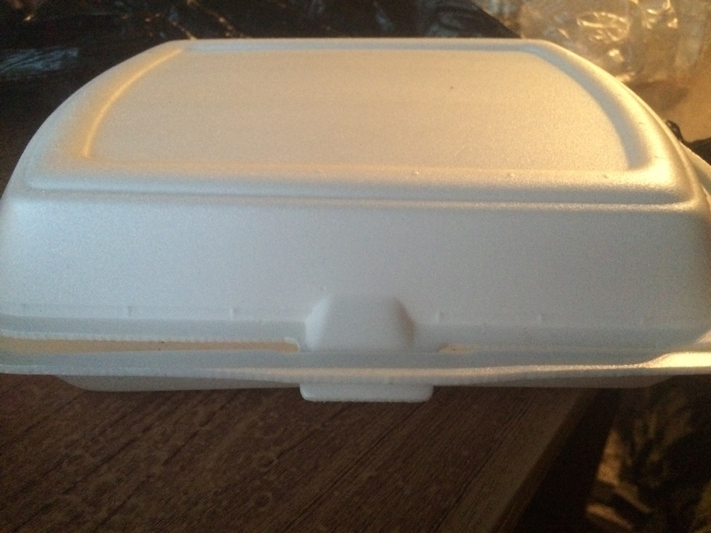
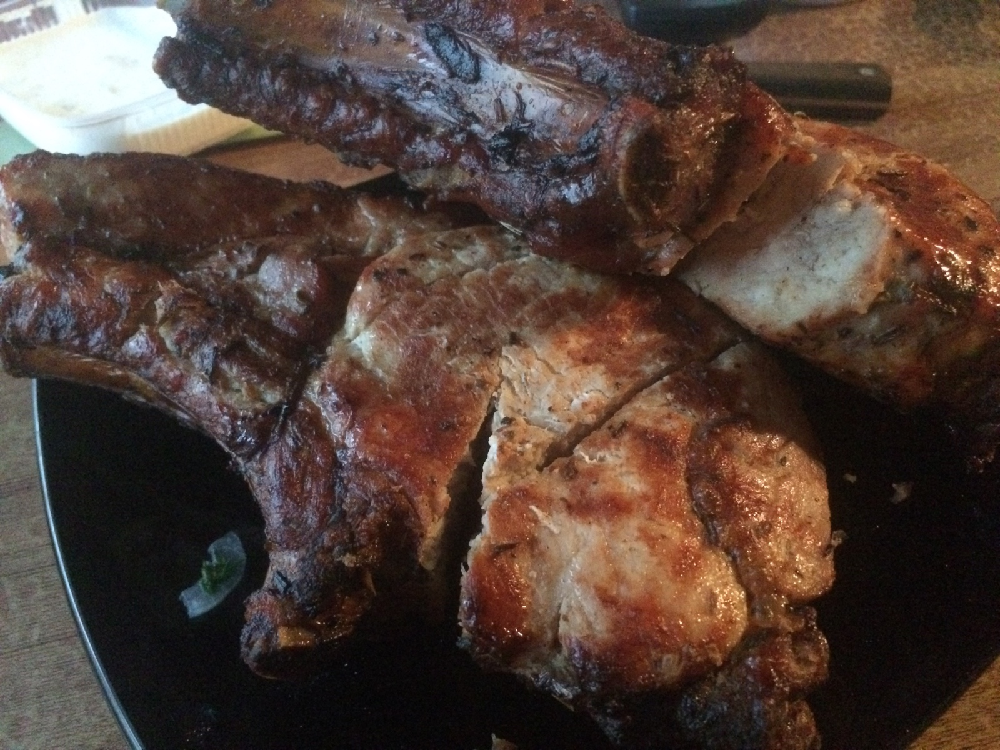

Не так давно узнал о существовании сего заведения, а сегодня жутко захотел шашлыка и решил там заказать. Какую же я совершил ошибку, забегая вперед, скажу — я наелся. Когда я слышу, что лицо кавказской национальности готовит шашлык, я представляю сочный жареный кусок мяса. Но, видимо, это стереотип, и не все умеют готовить его.

Единственный способ заказа шашлыка- звонок. Позвонил, ответила женщина, сделал заказ, сказали, что привезет через 1 — 1,5 часа. Ну срок не критичный, сел ждать. И вот через 85 минут, раздался звонок: "Это доставка". Ну вот, сейчас то наемся, что зря столько ждал? Но тут сразу первое же разочарование, сдачи нет, предложили оставшуюся сумму перевести на телефон. Ну думаю ок, переводите, сумма не велика. Но вот прошло уже 16 часов, а денег нет на телефоне. И это первый косяк.

> Мы с радостью приготовим и доставим Вам горячий шашлык с мангала в любое время дня и ночи, в будние дни за час, в выходные и праздничные дни 1,5-2 часа.

Второй косяк, в чем доставляют. Целлофановый пакет и одноразовый контейнер, который даже не закрыт. Из-за всего этого шашлык приехал чуть теплый. Ауу, ребята! 21 век на дворе! 21, ребята! Уже давно изобрели [термосумки](https://duckduckgo.com/?q=%D1%82%D0%B5%D1%80%D0%BC%D0%BE%D1%81%D1%83%D0%BC%D0%BA%D0%B0&atb=v3&ia=about). Когда я заказываю шашлык, я надеюсь, что он приедет горячим, а не чуть теплым.

Сочный шашлык? У Карена? Забудьте, нахрен. Ни черта он не сочный, сухой как фиг знает что. Плюс искромсали куски и выглядят они как черт пойми что. Ну вот расскажите мне, вы для чего покромсали то? Это номер три.

Хотите шашлыка? Идите и приготовьте, ну или найдите свою любимую шашлычку и покупайте там. Но минуйте шашлычку у Карена, у него mierda.