CSS фреймворки — это как полуфабрикаты, первичная структура уже есть, но чтоб продукт был готов надо приложить собственные рученьки к этому. Они помогу сэкономить вам уйму времени, так как у них уже есть основная структура и вам не надо рисовать ее с самого ноля. Их в нашем мире огромное множество, сделал не большую подборку на мой взгляд лучший и самых актуальных на сегодняшний день. Пользуйтесь.

## [Material framework](http://nt1m.github.io/material-framework/)

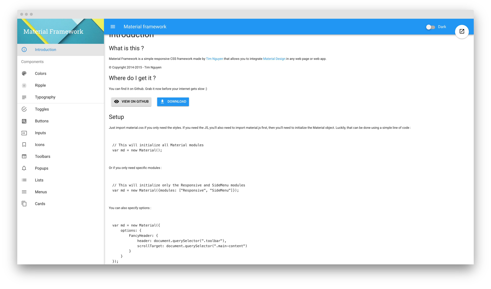

## [Materialize](http://materializecss.com/)

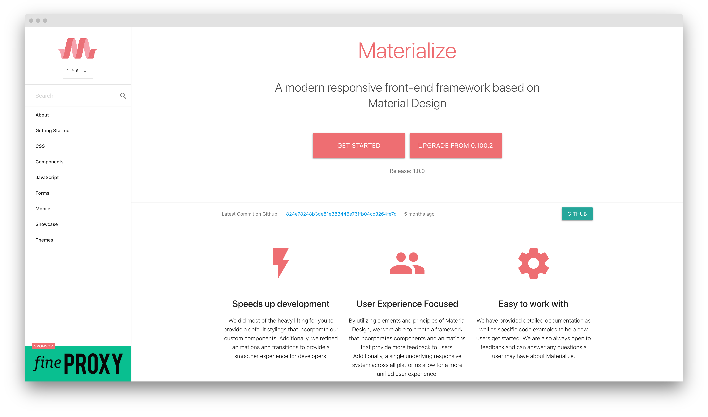

## [Bootstrap](http://getbootstrap.com/)

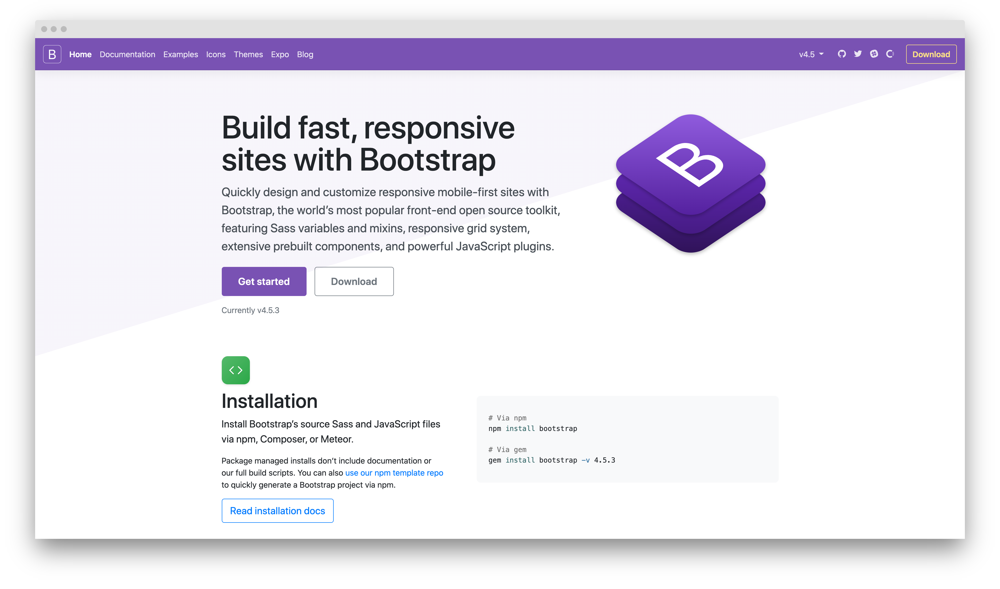

## [Semantic UI](http://semantic-ui.com/)

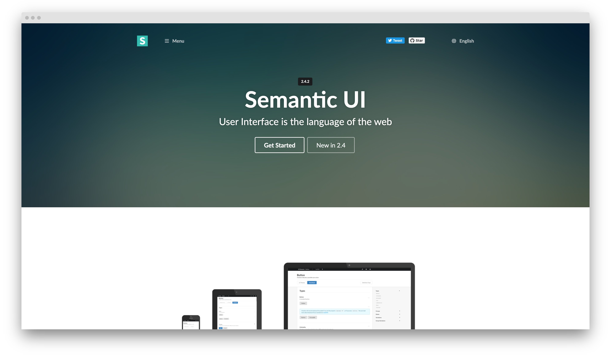

## [Foundation](http://foundation.zurb.com/)

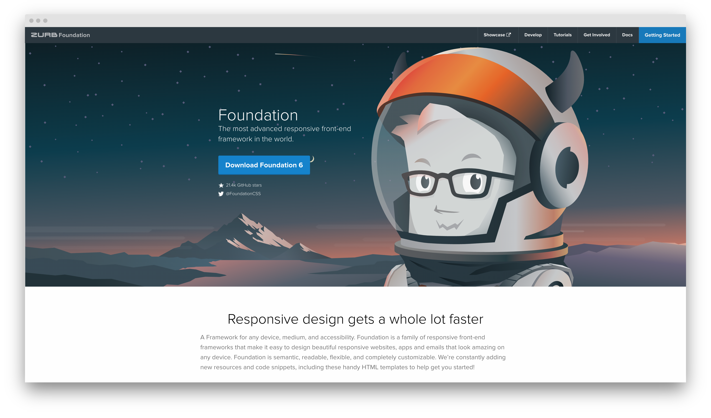

## [Baseguide](http://basegui.de/)

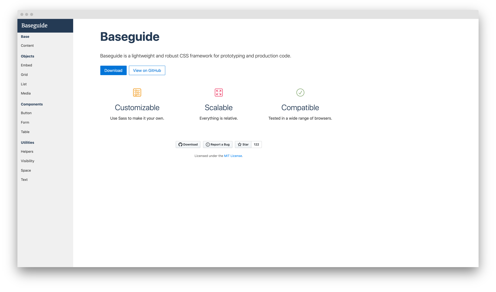

## [Sculpt](https://www.heartinternet.uk/sculpt)

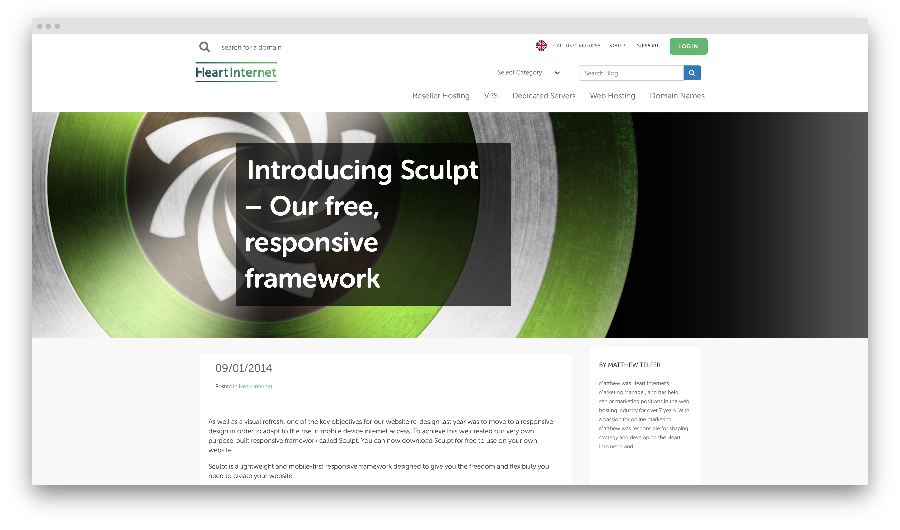

## [Concise CSS](http://concisecss.com/)

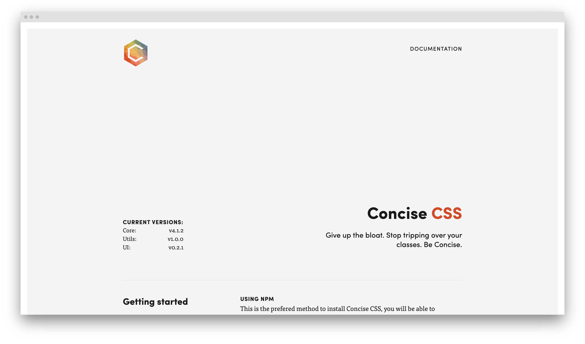

## [Blueprint](http://www.blueprintcss.org/)

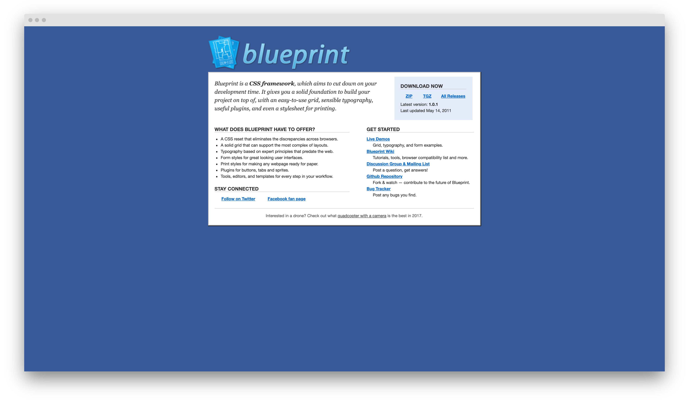

## [UIkit](http://getuikit.com/)

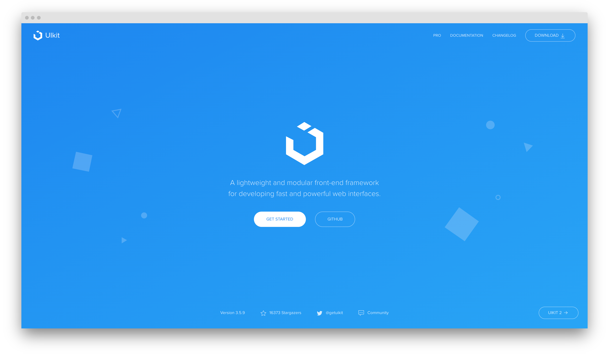

## [Schema](http://danmalarkey.github.io/schema/)

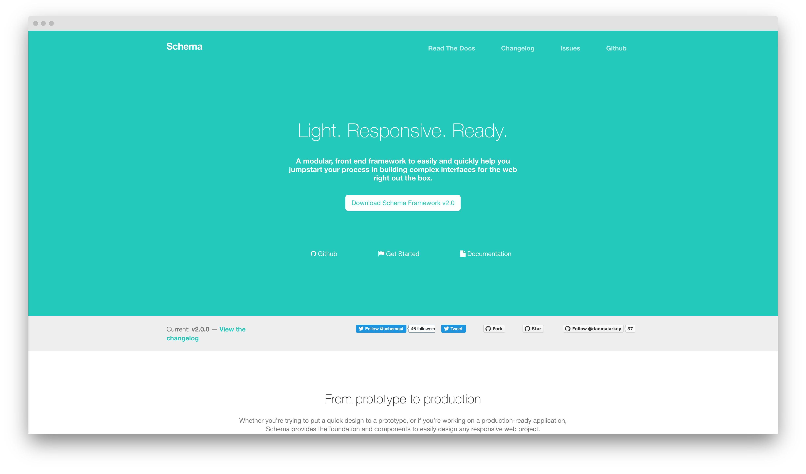

## [Metro UI](http://metroui.org.ua/)

## [Responsive Grid System](http://www.responsivegridsystem.com/)

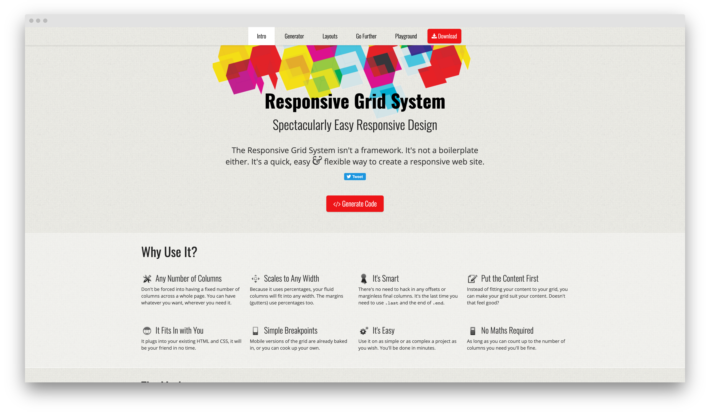

## [YAML](http://www.yaml.de/)

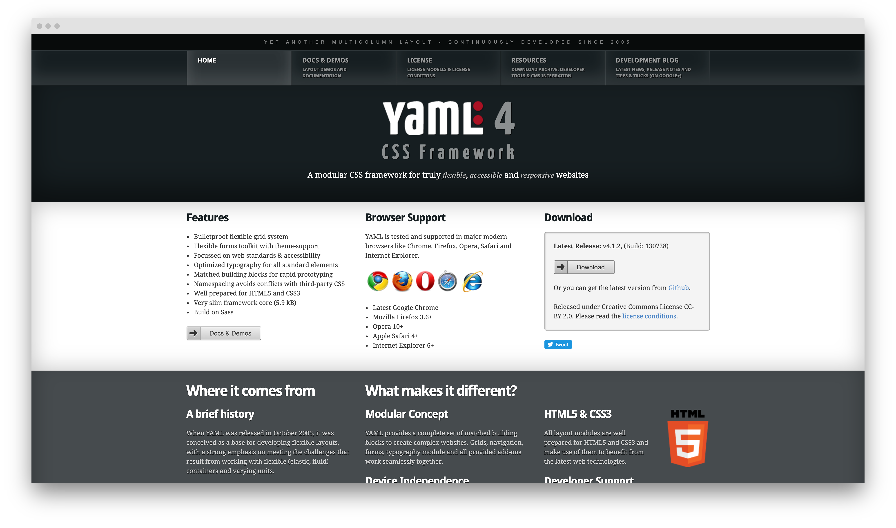